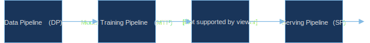

# A Positive Reinforcement Loop 

What are the disciplines that need to cross fertilize to get a system that possesses intelligence? Lets start with a diagram that show not only the disciplines but also a way of working for the many specialists involved.

The diagram above highlights three fundamental axes that can deliver a system-based approach to AI. The Z axis is the scientific axis where many disciplines such as psychology, neuroscience, mathematics and others make progress on. The X axis involves the ML/AI communities that borrow ideas from their colleagues in sciences and convert those theories and pragmatic findings into abstractions (models and methods). The model of the neuron, the perceptron, appeared in psychology journals many decades ago and despite its simplicity it is still the unit via which much more complicated neural networks are constructed from.  Todays' models of Long-Term Short-Term Memory (LSTM), Replay Memory and many others not shown in the diagram (as its currently in draft form) are abstractions (models) of discoveries that scientists produced after tens of years of research.  To *use* however these methods and models effectively, major hardware and software components need to be developed also known as *computing and frameworks* - these live in the Y axis.  They are very important for the development of AI field that is known to be heavily experimental, requiring especially at the perceptive frontend significant computational power and automation. 

At a very high level, progress in AI is made via the counterclockwise iteration Z -> X -> Y -> Z. AI engineers look at the neuroscience/psychology axis,  map discoveries to points in the methods / models axis, and finally develop these methods in hardware architectures and software frameworks. But what can explain the Y -> Z flow? Frameworks in turn help the neuroscientists and psychologists as they can provide generative models of their own discoveries or help them simulate conditions that are not possible using their native tools. 

This counter-clockwise multidisciplinary iteration acts as a positive feedback loop accelerating the progress in the AI space.

In this course we will be focusing on the *methods/models* and *frameworks* axis and understand what these models can offer us and how we can apply them in synthesizing an AI system at least for a domain of interest. 

# A typical AI stack today

As we have seen from the [syllabus](), this course approaches AI from an applied perspective - this means teaching concepts but at the same time looking how these concepts are applied in the industry to solve real world problems. In this respect here we take an architecture driven AI, presenting the components of AI in a form of a software stack but also how the components are mechanized in what we call **ML Pipelines** to provide the ML utility to applications. For a complete overview of real world ML pipelines used today go through the [TFX](http://stevenwhang.com/tfx_paper.pdf) paper in its entirety.

*AI Stack circa 2019*

## Landscape of the AI ecosystem
Due to the complexity and common interest to addresses industrial players are partnering to define and implement the necessary components for the complete automation of AI pipelines.  This work is going in within the [Linux Foundation AI (sub)Foundation](https://landscape.lfai.foundation/fullscreen=yes)amongst many other open source communities.

<section class="bg-apple">
              

          <iframe width="2120" height="630" src="https://landscape.lfdl.io/format=landscape&fullscreen=yes" frameborder="0" allowfullscreen></iframe>
          

</section>

## The four pipelines of an end-to-end ML platform

*Example of end to end pipeline - serial arrangement*

*Example of Data Pipeline*

*Example of Model Training Pipeline*

*Example of Model Evaluation and Validation Pipeline*

*Example of Serving Pipeline*

## Roles in AI product development

*Who data scientists need to interact with, during the development of AI systems?*

> "Any organization that designs a system (defined broadly) will produce a design whose structure is a copy of the organization's communication structure." http://www.melconway.com/Home/Conways_Law.html

"We do research differently here at Google. Research Scientists aren't cloistered in the lab, but instead they work closely with Software Engineers to discover, invent, and build at the largest scale."

Contrast this to an organizational structure that isolates researchers from product development.  What about Alphabet's X https://x.company/ ?

