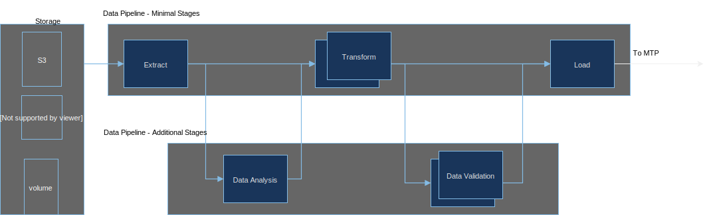

## A typical AI stack today

As we have seen from the [syllabus](/syllabus/index), this course approaches supervised and unsupervised learning methods from an applied perspective - this means teaching concepts but at the same time looking how these concepts are applied in the industry to solve real world problems. In this respect here we take an architecture driven AI, presenting the components of AI in a form of a software stack but also how the components are mechanized in what we call **ML Pipelines** to provide the ML utility to applications. For a complete overview of real world ML pipelines used today go through the [TFX](http://stevenwhang.com/tfx_paper.pdf) paper in its entirety.

*AI Stack circa 2019*

### Landscape of the AI ecosystem
Due to the complexity and common interest to addresses industrial players are partnering to define and implement the necessary components for the complete automation of AI pipelines.  This work is going in within the Linux Foundation and Deep Learning Foundation amongst many other open source communities.

<section class="bg-apple">
              

                  <h2>Linux Foundation - Deep Learning Foundation</h2>
          <iframe width="2120" height="630" src="https://landscape.lfdl.io/format=landscape&fullscreen=yes" frameborder="0" allowfullscreen></iframe>
          

</section>

[Deep Learning Foundation ecosystem.](https://landscape.lfai.foundation/fullscreen=yes)
 

## The four pipelines of an end to end data mining platform

*Example of end to end pipeline - serial arrangement*

*Example of Data Pipeline*

*Example of Model Training Pipeline*

*Example of Model Evaluation and Validation Pipeline*

*Example of Serving Pipeline*

