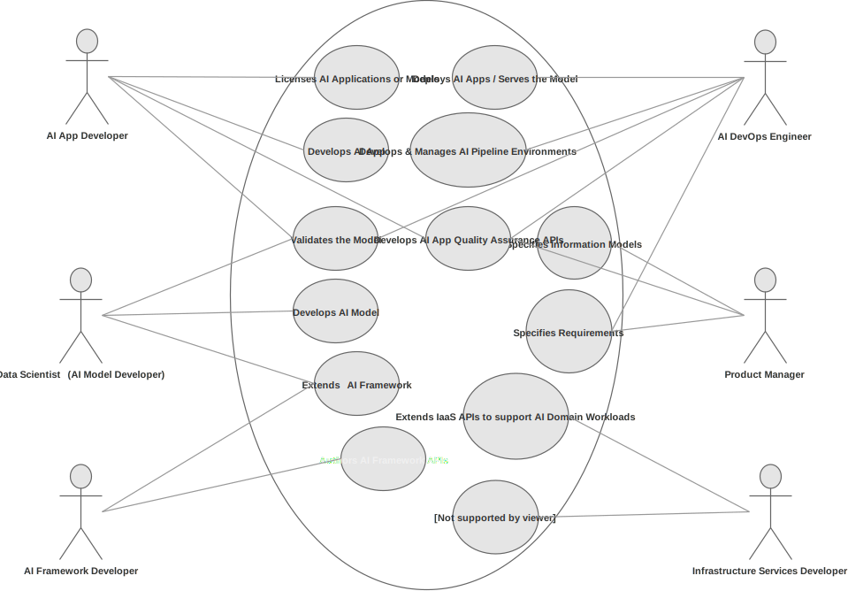

## A Positive Reinforcement Loop 

What are the disciplines that need to cross fertilize to get a system that possesses intelligence? Lets start with a diagram that show not only the disciplines but also a way of working for the many specialists involved.

The diagram above highlights three fundamental axes that can deliver a system-based approach to AI. The Z axis is the scientific axis where many disciplines such as psychology, neuroscience, mathematics and others make progress on. The X axis involves the ML/AI communities that borrow ideas from their colleagues in sciences and convert those theories and pragmatic findings into abstractions (models and methods). The model of the neuron, the perceptron, appeared in psychology journals many decades ago and despite its simplicity it is still the unit via which much more complicated neural networks are constructed from.  Todays' models of Long-Term Short-Term Memory (LSTM), Replay Memory and many others not shown in the diagram (as its currently in draft form) are abstractions (models) of discoveries that scientists produced after tens of years of research.  To *use* however these methods and models effectively, major hardware and software components need to be developed also known as *computing and frameworks* - these live in the Y axis.  They are very important for the development of AI field that is known to be heavily experimental, requiring especially at the perceptive frontend significant computational power and automation. 

At a very high level, progress in AI is made via the counterclockwise iteration Z -> X -> Y -> Z. AI engineers look at the neuroscience/psychology axis,  map discoveries to points in the methods / models axis, and finally develop these methods in hardware architectures and software frameworks. But what can explain the Y -> Z flow? Frameworks in turn help the neuroscientists and psychologists as they can provide generative models of their own discoveries or help them simulate conditions that are not possible using their native tools. 

This counter-clockwise multidisciplinary iteration acts as a positive feedback loop accelerating the progress in the AI space.

In this course we will be focusing on the *methods/models* and *frameworks* axis and understand what these models can offer us and how we can apply them in synthesizing an AI system at least for a domain of interest. 

Lets us now look on how AI started, branched off to multiple schools of thought and view some examples. 

## Roles in AI product development

*Who data scientists need to interact with, during the development of an app?*

## Data Scientist - Engineering Job Description
This is a sample job description from Google. 

**Technologies**
machine-learning

**Job description**

Minimum qualifications:

* MS degree in a quantitative discipline (e.g., statistics, operations research, bioinformatics, economics, computational biology, computer science, mathematics, physics, electrical engineering, industrial engineering).
* 2 years of relevant work experience in data analysis or related field. (e.g., as a statistician / data scientist / computational biologist / bioinformatician).
* Experience with statistical software (e.g., R, Python, Julia, MATLAB, pandas) and database languages (e.g., SQL).

**Preferred qualifications:**

* PhD degree in a quantitative discipline as listed in Minimum Qualifications.
* 4 years of relevant work experience (e.g., as a statistician / computational biologist bioinformatician / data scientist), including deep expertise and experience with statistical data analysis such as linear models, multivariate analysis, stochastic models, sampling methods. Analytical engagements outside class work while at school can be included.
* Applied experience with machine learning on large datasets.
* Experience articulating business questions and using mathematical techniques to arrive at an answer using available data. Experience translating analysis results into business recommendations.
* Demonstrated skills in selecting the right statistical tools given a data analysis problem. Demonstrated effective written and verbal communication skills.
* Demonstrated leadership and self-direction. Demonstrated willingness to both teach others and learn new techniques.

**About the job**

As a Data Scientist, you will evaluate and improve Google's products. You will collaborate with a multi-disciplinary team of engineers and analysts on a wide range of problems. This position will bring analytical rigor and statistical methods to the challenges of measuring quality, improving consumer products, and understanding the behavior of end-users, advertisers, and publishers.

Google is and always will be an engineering company. We hire people with a broad set of technical skills who are ready to take on some of technology's greatest challenges and make an impact on millions, if not billions, of users. At Google, data scientists not only revolutionize search, they routinely work on massive scalability and storage solutions, large-scale applications and entirely new platforms for developers around the world. From Google Ads to Chrome, Android to YouTube, Social to Local, Google engineers are changing the world one technological achievement after another.

**Responsibilities**

* Work with large, complex data sets. Solve difficult, non-routine analysis problems, applying advanced analytical methods as needed. Conduct end-to-end analysis that includes data gathering and requirements specification, processing, analysis, ongoing deliverables, and presentations.
* Build and prototype analysis pipelines iteratively to provide insights at scale. Develop comprehensive understanding of Google data structures and metrics, advocating for changes where needed for both products development and sales activity.
* Interact cross-functionally with a wide variety of people and teams. Work closely with engineers to identify opportunities for, design, and assess improvements to google products.
* Make business recommendations (e.g. cost-benefit, forecasting, experiment analysis) with effective presentations of findings at multiple levels of stakeholders through visual displays of quantitative information.
* Research and develop analysis, forecasting, and optimization methods to improve the quality of Google's user facing products; example application areas include ads quality, search quality, end-user behavioral modeling, and live experiments.
At Google, we don’t just accept difference—we celebrate it, we support it, and we thrive on it for the benefit of our employees, our products and our community. Google is proud to be an equal opportunity workplace and is an affirmative action employer. We are committed to equal employment opportunity regardless of race, color, ancestry, religion, sex, national origin, sexual orientation, age, citizenship, marital status, disability, gender identity or Veteran status. We also consider qualified applicants regardless of criminal histories, consistent with legal requirements. See also Google's EEO Policy and EEO is the Law. If you have a disability or special need that requires accommodation, please let us know by emailing candidateaccommodations@google.com

## Reearch Scientist, Machine Learning and Intelligence,  Job Description

This is another sample job description from Google. Spot the differences with the previous one. 

**Minimum Qualifications**

* PhD in Computer Science, related technical field or equivalent practical experience.
* Programming experience in one or more of the following: C, C++ and/or Python.
* Experience in Natural Language Understanding, Computer Vision, Machine Learning, Algorithmic Foundations of Optimization, Data Mining or Machine Intelligence (Artificial Intelligence).
* Contribution to research communities and/or efforts, including publishing papers at conferences such as NIPS, ICML, ACL, CVPR, etc.

**Preferred Qualifications**
* Relevant work experience, including experience working within the industry or as a researcher in a lab.
* Ability to design and execute on research agenda.
* Strong publication record.

**About The Job**
Research in machine intelligence has already impacted user-facing services across Google including Search, Maps and Google Now. Google Research & Machine Intelligence teams are actively pursuing the next generation of intelligent systems for application to even more Google products. To achieve this, we’re working on projects that utilize the latest techniques in Machine Learning (including Deep Learning approaches like Google Brain) and Natural Language Understanding.

We’ve already been joined by some of the best minds, and we’re looking for talented Research Scientists that have applied experience in the fields of Machine Learning, Natural Language Processing and Machine Intelligence to join our team.

We do research differently here at Google. Research Scientists aren't cloistered in the lab, but instead they work closely with Software Engineers to discover, invent, and build at the largest scale. Ideas may come from internal projects as well as from collaborations with research programs at partner universities and technical institutes all over the world. From creating experiments and prototyping implementations to designing new architectures, Research Scientists and Software Engineers work on challenges in machine perception, data mining, machine learning, and natural language understanding. You stay connected to your research roots as an active contributor to the wider research community by partnering with universities and publishing papers.

There is always more information out there, and Research and Machine Intelligence teams have a never-ending quest to find it and make it accessible. We're constantly refining our signature search engine to provide better results, and developing offerings like Google Instant, Google Voice Search and Google Image Search to make it faster and more engaging. We're providing users around the world with great search results every day, but at Google, great just isn't good enough. We're just getting started.

**Responsibilities**

* Participate in cutting edge research in machine intelligence and machine learning applications.
* Develop solutions for real world, large scale problems.

At Google, we don’t just accept difference - we celebrate it, we support it, and we thrive on it for the benefit of our employees, our products and our community. Google is proud to be an equal opportunity workplace and is an affirmative action employer. We are committed to equal employment opportunity regardless of race, color, ancestry, religion, sex, national origin, sexual orientation, age, citizenship, marital status, disability, gender identity or Veteran status. We also consider qualified applicants regardless of criminal histories, consistent with legal requirements. If you have a disability or special need that requires accommodation, please let us know.

To all recruitment agencies Google does not accept agency resumes. Please do not forward resumes to our jobs alias, Google employees or any other company location. Google is not responsible for any fees related to unsolicited resumes

## A Note Conways' Law
> "Any organization that designs a system (defined broadly) will produce a design whose structure is a copy of the organization's communication structure." http://www.melconway.com/Home/Conways_Law.html

"We do research differently here at Google. Research Scientists aren't cloistered in the lab, but instead they work closely with Software Engineers to discover, invent, and build at the largest scale."

Contrast this to an organizational structure that isolates researchers from product development.  What about Alphabet's X https://x.company/ ?

