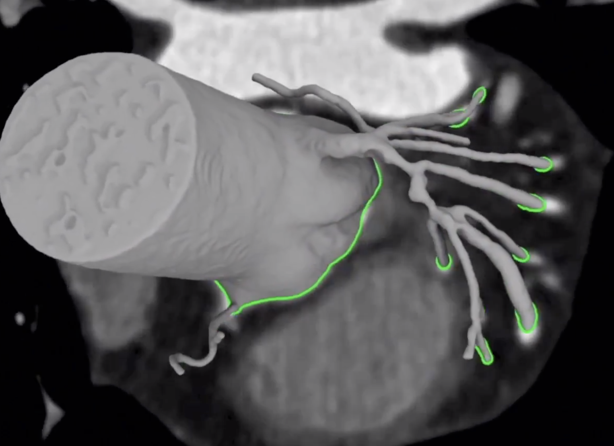

## AI Evolution according to DARPA

If engineering difficulty has a pinnacle today this must be in AI domains that combines ML, optimal control and planning. autonomous cars and humanoids from Boston Dynamics fit the bill.

Initially there were rules.

* In the 1980s *knowledge-base* systems that hard-coded knowledge about the world in formal languages.
  * IF this happens, THEN do that.
* They failed to get significant traction as the number of rules that are needed to model the real world exploded.
* However, they are still in use today in vertical modeling domains e.g. fault management. For example Rule Based Engines are used today in many complex systems that manage mission critical infrastructures e.g. [ONAP](http://wiki.onap.org).

The introduction of advanced AI methods few years ago, created a situation we can explain with the following analogy.

*A nautical analogy on where we are today on AI for mission critical systems. Can you notice anything strange with this ship (Cumberland Basin, photo taken April 1844)?*

To put order into the many approaches and methods for delivering AI in our lives, DARPA classified AI development in terms of "waves". 

<table style="width:130%; table-layout:fixed;">
  <tr>
    <td>

          <iframe src="https://www.youtube.com/embed/qnKSfY_RDOU"></iframe>
        
</td>
    <td>

            <iframe src="https://www.youtube.com/embed/1dBLLB2qasM"></iframe>
          
</td>
    <td>

          <iframe src="https://www.youtube.com/embed/LikxFZZO2sk"></iframe>
          
</td>
  </tr>
  <tr>
    <td>Wave I: GOFAI</td>
    <td>Wave II: Connectionism</td>
    <td>Wave III: AGI</td>
  </tr>
</table>

In the 1980s Rule Based Engines started to be applied manifesting the first wave of AI introduction. In this example you see a system that performs highway trajectory planning. A combination of cleverly designed rules does work and offers real time performance but cannot *generalize* and therefore have acceptable performance in other environments.

Wave II srarted soon after 2010 - we started to apply a different philosophy in solving intelligent tasks such as object classification. The philosophy of connectionism and the so called deep neural network architectures, dominate today relative simple (and mostly self-contained) tasks.

Wave III is at present an active research area driven primarily from our inability to implement with just deep neural networks things like long-term goal planning, causality, extract meaning from text like humans do, explain the decisions of neural networks, transfer the learnings from one task to another, even similar, task. Artificial General Intelligence is the term usually associated with such capabilities.

Further, we will see a fusion of disciplines such as physical modeling and simulation with representation learning to help deep neural networks learn using data generated by domain specific simulation engines.

*Reveal the stenosis:Generative augmented physical (Computational Fluid Dynamics) modeling from Computer Tomography Scans*

For example in the picture above a CFD simulation is used to augment ML algorithms that predict **and explain** those predictions.  I mission critical systems (such as medical diagnostic systems) everything must be  **explainable**.

The course [syllabus](../..) to understand what elements of Wave II AI systems we will cover in this course. 

