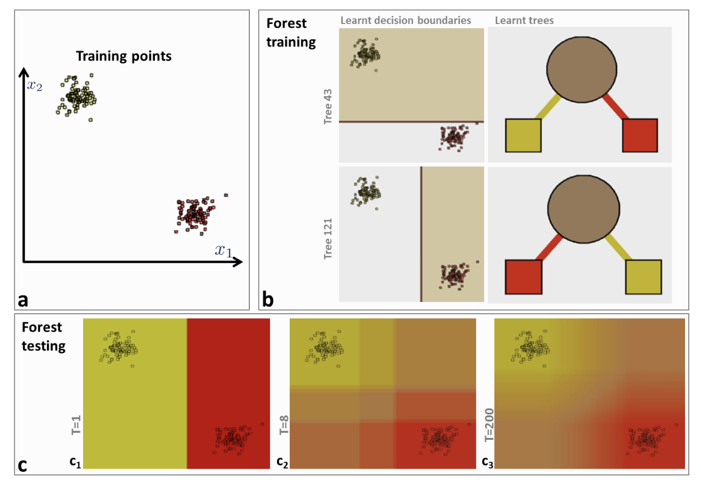

# Random Forests

Random forests is a popular and very strong ML algorithm that belongs to what is called ensemble learning methods. As the name implies they use many classification [tree]() learners to improve on their generalization ability. Each of the trees is called the *weak learner* - when grouped together they form the strong learner. 

A key aspect of decision forests is the fact that its component trees are all randomly different from one another. This leads to de-correlation between the individual tree predictions and, in turn, to improved generalization. Forest randomness also helps achieve high robustness with respect to noisy data. Randomness  is  injected  into  the  trees  during  the  training  phase. Two of the most popular ways of doing so are:

1. Random training data set sampling (when sampling is performed with replacement, this is called **bagging**), 
2. Randomized node optimization.

These  two  techniques  are  not  mutually  exclusive  and  could  be  used together.  

In the sklearn library, the Random Forest algorithm introduces extra randomness when growing trees; instead of searching for the very best feature when splitting a node, it searches for the best feature among a random subset of features. This results in a greater tree diversity. In addition, we can make trees even more random by also using random thresholds for each feature rather than searching for the best possible thresholds - also known as Extra-Trees. 

## Inference

*Example of three trees receiving the instance $\mathbf x$ (shown as $\mathbf v$ in the figure)* 

During testing the same unlabelled test input data $\mathbf x$  is pushed through each component tree. At each internal node a test is applied and the data point sent to the appropriate child. The process is repeated until a leaf is reached. At the leaf the stored posterior $p_t(c|\mathbf x)$ is read off. The forest class posterior $p(c|\mathbf x)$ is simply the **average** of all tree (T) posteriors.

$p(c|\mathbf x) = \frac{1}{T} \sum_{t=1}^T p_t(c|\mathbf x) $

## Impact of random forest parameters
Given a training dataset with two classes (a), different training trees produce different partitions and thus different leaf predictors. The colour of tree nodes and edges indicates the class probability of training points  going  through  them (b)  In  testing,  increasing  the  forest  size $T$ produces smoother class posteriors. 

