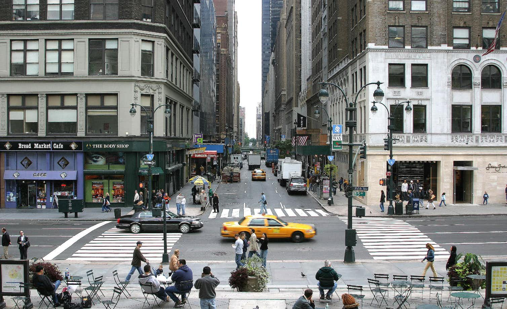
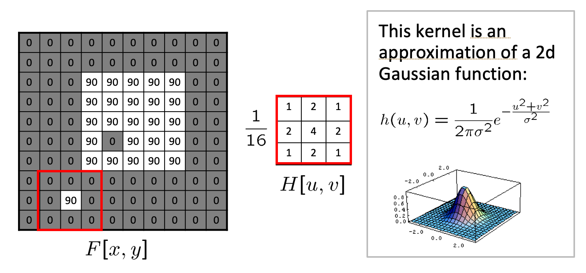

# Introduction to Convolutional Neural Networks

As elaborated [here](http://theconversation.com/how-do-our-brains-reconstruct-the-visual-world-49276), humans build up a more schematic version of the environment across eye fixations than was previously thought. This schematic version of the environment is typically known as **scene gist**. It contains conceptual information about the scene’s basic category – is it natural, human-made, a cityscape? – and general layout, maybe limited to a few objects and/or features. This schematic version of the environment is a far cry from the “picture in the head” scenario. But it’s this schematic information that guides us from one eye fixation to the next, during which more detailed information can be sampled. In the picture above, the brain will first detect the cityscape schematic and then process one of the scene fixations - e.g. the yellow cab.

As we will see shortly images-based datasets are almost exclusively used for instructive purposes in CNNs. The reason is simple. With images we are able to "see" the effects of a number of important algorithms that are related to classification, object detection etc. 

Focusing at the "fixation" stage of human vision, CNNs are biologically inspired from the structure that the neuroscientists David Hubel and Torsten Wiesel saw in the so called V1 region of the brain - the region at the back of our head that is responsible for the processing of visual sensory input signals coming from the eye's retina. 

## Color images as functions

A grayscale picture can be seen as a function $f(x,y)$ of light intensities, where x and y are the rows and columns of pixels in the image. 

Usually we have border constraints in the range of the input pixels e.g. $x \in [a,b], y \in [c,d]$ but also in the output intensity values (typically 8-bit encoding is assumed that limits the values to [0, 255]). 

The city scape color image above can also be seen as a vector function:

$$f(x,y)=  \begin{bmatrix} r(x,y) \\ g(x,y) \\ b(x,y)  \end{bmatrix}$$

with its elements capturing the **channels** Red, Green and Blue functions, the mixture (superposition) of which can generate the pixel color of the original image. 

Please note the convention to refer to the **columns** $j$ of the matrix that represents each function with $x$ and to the rows $i$ with $y$. This may cause some confusion at first. 

## The Convolution & Cross-Correlation Operation

In this section we review many important to CNN operations that were inherited from digital signal processing.

### The Convolution & Cross-Correlation Operation

We will go through the signal processing operation of convolution giving emphasis to 2D convolution that we will soon meet at one of the per layer operations performed in Convolutional Neural networks.

Note that in ML frameworks the implementation of the convolution operation varies. First, the convolution operation in some frameworks is the *flipped* version - this is perfectly fine as the convolution operation is commutative. 

$$S(i,j) = \sum_m \sum_n x(m, n) h(i-m,j-n) = \sum_m \sum_n x(i-m, j-n)h(m,n)$$

where $x$ is the input of the convolution and $h$ is the kernel or filter typically of smaller spatial dimensions. 

Other frameworks don't even implemented convolution but they do the very similar **cross-correlation** operation below and they sometimes call it convolution to add to the confusion. TF implements **this** operation.

$$S(i,j) = \sum_u \sum_v x(i+u, j+v)h(u,v)$$

You should not be concerned with the framework implementation details, the thing that is important for you to grasp is the essence of the operation which is best explained using some simple examples. 

### Examples of simple 2D filtering operations

#### Moving Average

In the class we will go through the simplest possible 2D filtering operation where the as shown below. 

*First step in 2D MA Filtering*

*Completed 2D MA Filtering*

#### 2D Gaussian

The above filtering operations are obviously deterministic. We are given the filter but in CNNs as we will see in the next section we are estimating the filters. To keep the terminology aligned with the dense neural networks layers we will be denoting the filter with $\mathbf w$ - the weights that need to be learned through the training process. 
