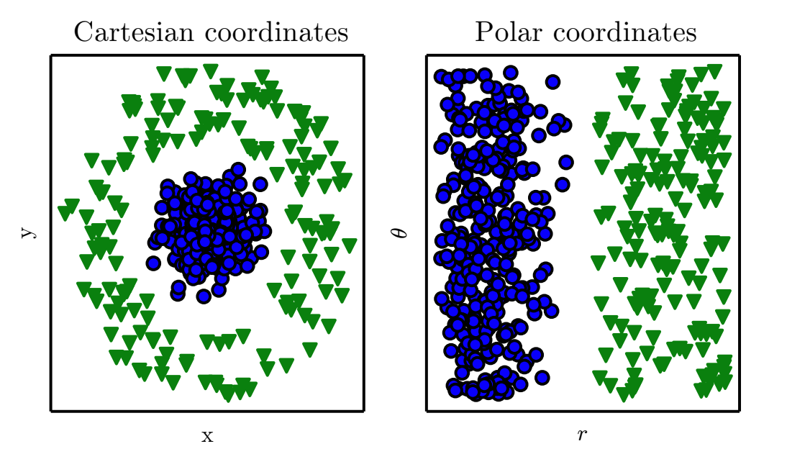
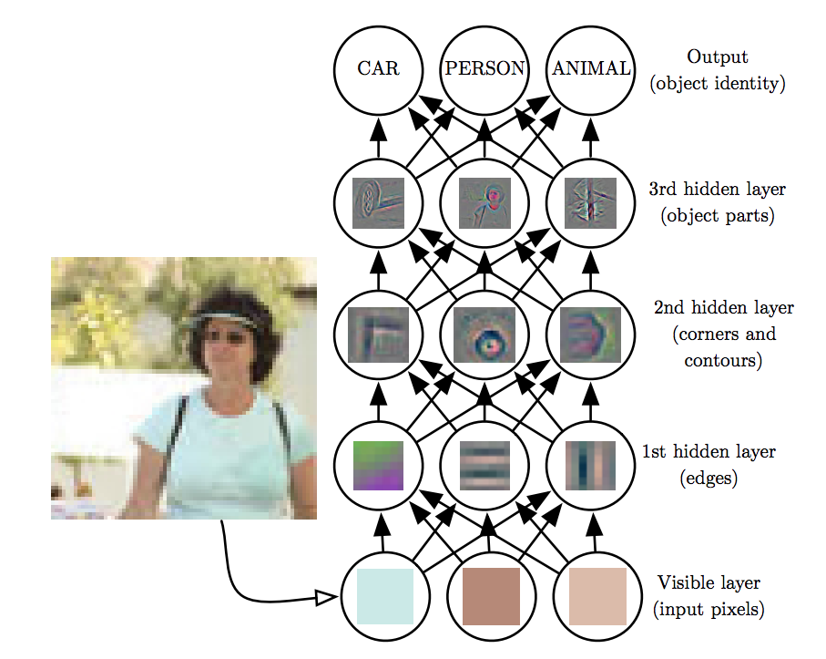
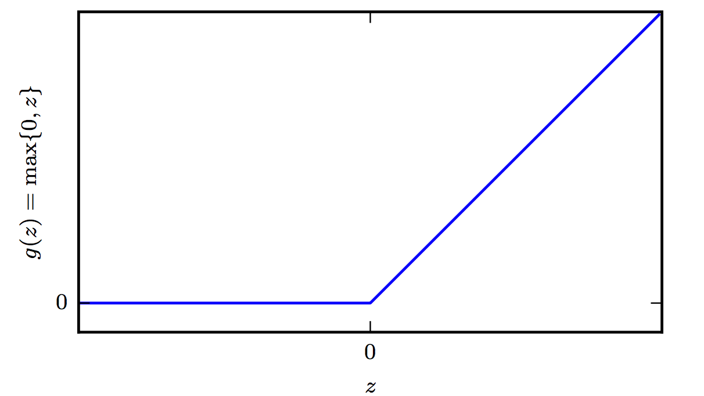

# Deep Neural Networks 

DNNs are the implementation of **connectionism**, the philosophy that calls for algorithms that perform function approximations to be constructed by an interconnection of elementary circuits called neurons. There are two main benefits that DNNs brought to the table, on top of their superior perfomance in large datasets.

## Automated Feature Construction (Representations)

Given  a synthetic dataset like this,  there is a thought process that a data scientist must undergo to transform the input into a suitable representation e.g. $(x,y)=(r\cos\theta,r\sin\theta)$ for a linear classifier to be able to provide a solution.

The DNN (even as small as a single neuron) will find such representation **automatically**.

## Hierarchical representations 
On top of the automated feature construction advantage, that even shallow networks can provide, features can be represented hierarchically as shown below.

In the next sections, we provides some key points on the following questions:

* What DNNs look like
* How they work (backpropagation)

We will use a combination of material from Ian Goodfellow's book chapter 6 and [CS331n](http://cs231n.stanford.edu/). Another excellent resource is Nielsen's [tutorial treatment of the subject](http://neuralnetworksanddeeplearning.com/).

NOTE: You can use [this](http://alexlenail.me/NN-SVG/index.html) to depict several DNN architectures - the fully connected ones can be used to draw rudimentary NNs and pencil them with back propagation equations. 
<iframe src="http://alexlenail.me/NN-SVG/index.html" width="900" height="1200"></iframe>

## Architecture 
Feedforward networks consist of elementary **units** that resemble the [perceptron](../classification/perceptron). These units are stacked up into layers. 

There are multiple layers:

1. The input layer
2. One or more hidden layers
3. The output layer

A typical DNN consists a trivial placeholder layer that feeds the network with input data $\mathbf x$ via an input layer.  One or more hidden layers that that employ one ore more activation functions and  output layer that usually takes the shape for classification problems of a **softmax** function. 

## Activation Functions
There are several possible but we limit the discussion just three here.
    
1. The perceptron activation function which we have seen [here](../classification/perceptron):

    $$g(a) = \begin{cases}1.0 &\text{if } a \geq 0 \\\\ -1.0 &\text{if } a < 0 \end{cases}$$

2. The sigmoid activation function that we have also seen during [logistic regression](../classification/logistic-regression). 
       
    $$g(a) = \sigma(a) = \frac{1}{1+e^{-a}}  \hspace{0.3in} \sigma(a) \in (0,1)$$

    Towards either end of the sigmoid function, the $\sigma(a)$ values tend to respond much less to changes in a **vanishing gradients**. The neuron refuses to learn further or is drastically slow. 

3. The Rectified Linear Unit activation function - very popular in Deep Learning. 

    

    The RELU is very inexpensive to compute compared to sigmoid and it offers the following benefit that has to do with sparsity: Imagine an MLP  with random initialized weights to zero mean ( or normalised ). Almost 50\% of the network yields 0 activation because of the characteristic of RELU. This means a fewer neurons are firing (sparse activation) making the the network lighter and more efficient.  On the other hand for negative $a$, the gradient can go towards 0 and the weights will not get adjusted during descent. 

## Softmax Output units
The softmax output unit is a generalization of the sigmoid for problems with more than two classes. 

$$\text{softmax}(\mathbf z)_i = \arg \max_i \frac{\exp (z_i)}{\sum_i \exp(z_i)}$$

where $i$ is over the number of inputs of the softmax function.

From a neuroscientific point of view, it is interesting to think of the softmax as a way to create a form of competition between the units that participate in it: the softmax outputs always sum to 1 so an increase in the value of one unit necessarily corresponds to a decrease in the value of others. This is analogous to the lateral inhibition that is believed to exist between nearby neurons in the cortex. At the extreme (when the difference between the maximal and the others is large in magnitude) it becomes a form of winner-take-all(one of the outputs is nearly 1, and the others are nearly 0).
