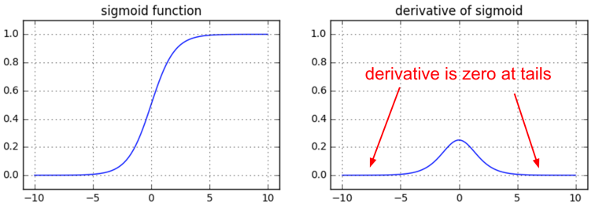
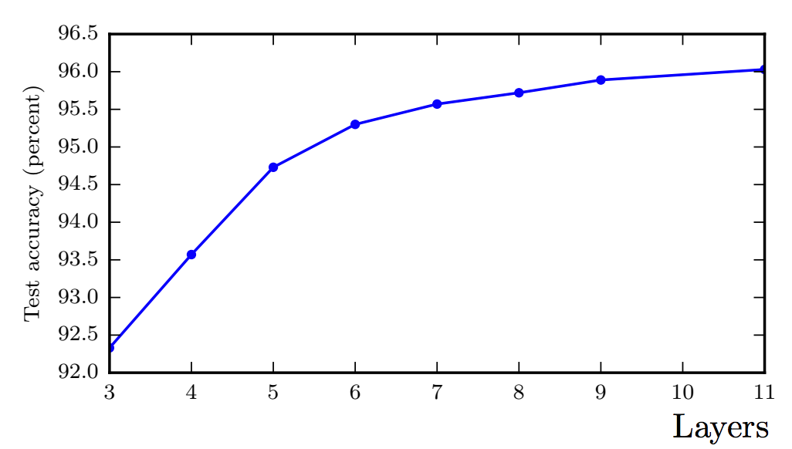

# Backpropagation in Deep Neural Networks

Now that we have persuaded ourselves that backpropagation is a procedure that involves the repetitive application of the chain rule, let us look more specifically its application to neural networks and the gates that we usually meet there. In NNs we are dealing with vectors, matrices and in general tensors and therefore its required to review first how we can expand on the template above for these data types.

In the following we heavily borrow from [this](https://web.stanford.edu/class/cs224n/readings/gradient-notes.pdf) text. The basic building block of vectorized gradients is the *Jacobian Matrix*. Suppose we have a function $f: \mathbb{R}^n \to \mathbb{R}^m$ that maps a vector of length $n$ to a vector of length $m$: 

$$f(x) = [f_1(x_1, ..., x_n), f_2(x_1, ..., x_n), ..., f_m(x_1, ..., x_n)]$$. 

Then its Jacobian is:

$$\frac{\partial f}{\partial x} = 
\begin{bmatrix} \frac{\partial f_1}{\partial x_1} & \dots & \frac{\partial f_1}{\partial x_n} \\\\ \vdots & \dots & \vdots \\\\ \frac{\partial f_m}{\partial x_1} & \dots & \frac{\partial f_m}{\partial x_n} \end{bmatrix}$$

The Jacobian matrix will be useful for us because we can apply the chain rule to a vector-valued function just by multiplying Jacobians. 

As a little illustration of this, suppose we have a function $f(\mathbf x) = [f_1(x), f_2(x)]$ taking a scalar to a vector of size 2 and a function $g(\mathbf y) = [g_1(y_1, y_2), g_2(y_1, y_2)]$ taking a vector of size two to a vector of size two. Now let's compose them to get $g(x) = [g_1(f_1(x), f_2(x)), g_2(f_1(x), f_2(x))]$. Using the regular chain rule, we can compute the derivative of $g$ as the Jacobian

$$\frac{\partial g}{\partial x} = \begin{bmatrix} \frac{\partial}{\partial x}g_1(f_1(x), f_2(x))  \\\\ \frac{\partial} {\partial x}g_2(f_1(x), f_2(x))  \\\\ \end{bmatrix} =  \begin{bmatrix} \frac{\partial{g_1}}{\partial f_1}\frac{\partial{f_1}}{\partial x} + \frac{\partial{g_1}}{\partial f_2}\frac{\partial{f_2}}{\partial x}   \\\\ \frac{\partial{g_2}}{\partial f_1}\frac{\partial{f_1}}{\partial x} + \frac{\partial{g_2}}{\partial f_2}\frac{\partial{f_2}}{\partial x}  \end{bmatrix}$$

And we see this is the same as multiplying the two Jacobians:

 $$\frac{\partial{g}}{\partial x} = \frac{\partial{ g}}{\partial f}\frac{\partial{f}}{\partial x} = \begin{bmatrix} \frac{\partial{g_1}}{\partial f_1} & \frac{\partial{g_1}}{\partial f_2} \\\\ \frac{\partial{g_2}}{\partial f_1} & \frac{\partial{g_2}}{\partial f_2} \\\\ \end{bmatrix} \begin{bmatrix} \frac{\partial{f_1}}{\partial x} \\\\ \frac{\partial{f_2}}{\partial x} \\\\ \end{bmatrix}$$

[This](http://cs231n.stanford.edu/vecDerivs.pdf) is also another instructive summary that help us understand how to calculate the local gradients involved and the gate templates (identities) summarized below that are routinely found in neural network backpropagation calculations. Assume that  with $\mathbf W \in \mathbb{R}^{n \times m}, \mathbf x \in \mathbb{R}^m$. 

_Tables of Gates and Gradients used in backpropagating deep neural networks_

|  Gate | Solution  |
|---|---|
|  $\mathbf z = \mathbf W \mathbf x$ |  $\frac{\partial \mathbf z}{\partial \mathbf x} = \mathbf W$ |
|  $\mathbf z =  \mathbf x$ | $\frac{\partial \mathbf z}{\partial \mathbf x} = \mathbf I$  |
|  $\mathbf z =  f(\mathbf x)$ element-wise |  $\frac{\partial \mathbf z}{\partial \mathbf x} = \text{Diag}[ f'(\mathbf x) ]$ |
|  $\mathbf \delta =  \frac{\partial L}{\partial \mathbf z}$  |  $\frac{\partial L}{\partial \mathbf W} = \mathbf \delta^T \mathbf x$ |
|  $\mathbf z = \mathbf W \mathbf x$ | |
|  $\hat \mathbf y = \mathtt{softmax}(\mathbf z)$ | $\frac{\partial L}{\partial \mathbf z} = \hat \mathbf y - \mathbf y$ |
|  $L=CE(\mathbf y , \hat \mathbf y )$ | | 

During the lecture we will go through an NN example on the whiteboard that will use these gate gradients for the estimation of the gradient of the loss with respect to its parameters using backpropagation. 

## Backprop behavior during training
As documented [here](https://medium.com/@karpathy/yes-you-should-understand-backprop-e2f06eab496b) and in Geron's textbook, you also need to be watchful of the effects of the various non-linear gates on the gradient flow. 

For **sigmoid gate**, if you are sloppy with the weight initialization or data preprocessing these non-linearities can “saturate” and entirely stop learning — your training loss will be flat and refuse to go down. If your weight matrix W is initialized too large, the output of the matrix multiply could have a very large range (e.g. numbers between -400 and 400), which will make all outputs in the vector z almost binary: either 1 or 0. But if that is the case, $z*(1-z)$, which is **local** gradient of the sigmoid non-linearity, will in both cases become zero (“vanish”), making the gradient for both x and W be zero. The rest of the backward pass will come out all zero from this point on due to multiplication in the chain rule.

For ReLU gates, if a neuron gets clamped to zero in the forward pass (i.e. z=0, it doesn’t “fire”), then its weights will get zero gradient. This can lead to what is called the “dead ReLU” problem, where if a ReLU neuron is unfortunately initialized such that it never fires, or if a neuron’s weights ever get knocked off with a large update during training into this regime, then this neuron will remain permanently dead. 

Tensorflow can create a computational graph from the DNN model specification (python). These graphs can be visualized on the web UI with Tensorboard. Use the playground when you first learn about DNNs to understand the principles but dive into the MNIST using Tensorflow use case to understand the Tensorflow mechanics and how to debug Tensorflow python scripts both syntactically and logically. Logical debugging should happen using Tensorboard visualizations. 

<!-- ## Performance of DNNs

### Impact of depth on Performance

### Regularization

   
In many cases we need to address overfitting by adding in the objective function some tunable penalty term that prevents it. Such penalty term is usually:

$\lambda J_{penalty} = \lambda \left(\sum_l W_{(l)}^2 \right) $

where $l$ is the hidden layer index and $W$ is the weight tensor. 
     -->