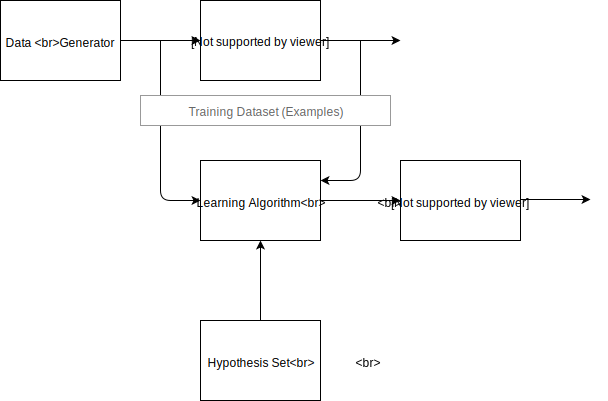

# The Learning Problem

We have seen various [agent]() designs but the ones that we will concentrate on this course are ones that can form _partially observed_ (PO) environment states using various sensing architectures. The perception block we have seen in the case where the agent is an autonomous car achieves that for example, and perception is rich in what is called Machine Learning (ML).  ML is a substantial subset of AI today and is not limited to just the perception part of an agent. 

Almost all machine learning algorithms depend heavily on the **representation** of the data they are given.  Each piece of, relevant to the problem, information that is included in the representation is known as a **feature**. Today's ML approaches such as deep learning actually **learn** the most suitable representations for the task at hand (still with a some help from experts) - an example is shown in the picture below. 

*Hierarchical Feature Learning*

## The Supervised Learning Problem Statement

Let us start with a classic formal definition of the supervised learning problem.

*Vapnik's formulation of the learning problem (enhanced)*

The description below is taken from Vadimir Vapnik's classic book [Statistical Learing Theory](https://www.amazon.com/Statistical-Learning-Theory-Vladimir-Vapnik/dp/0471030031), albeit with some enhancements on terminology to make it more in line with our purposes.  

The generator is a source of situations that determines the environment in which the target function (he calls it supervisor) and the learning algorithm act.  Here we consider the simplest environment: the data generator generates the vectors $\mathbf{x} \in \mathcal{X}$ independently and identically distributed (i.i.d.) according to some unknown (but fixed) probability distribution function $p(x)$.

These vectors are inputs to the target function (or operator); the target operator returns the output values $\mathbf{y}$. The target operator which transforms the vectors $\mathbf{x}$ into values y,  is **unknown** but we know that it  exists and does not change.

The learning algorithm observes the training dataset,

$$\{ (\mathbf{x}_1, y_1), \dots, (\mathbf{x}_m, y_m) \}$$

which contain input vectors $\mathbf{x}$ and the target response $\mathbf{y}$. During this period, the learning algorithm constructs some operator which will he used for prediction of the supervisor's answer $y_i$ on any specific vector $\mathbf{x}_i$  generated by the generator. The goal of the learning algorithm is  to construct an appropriate **approximation** of the target function - we will call this a hypothesis. The hypothesis can be iteratively constructed so the final hypothesis is the one that is used to produce the label $\hat{y}$. 

To be a mathematically correct, this general scheme of learning from examples needs some clarification. First of all,  we have to describe what kind of operators are used by the target function. In this book. we suppose that the target function returns the output $\mathbf{y}$ on the vector $\mathbf{x}$ according to  a conditional distribution function $p(\mathbf{y} | \mathbf{x})$ (this includes the case when the supervisor uses some function $\mathbf{y} = f(\mathbf{x}))$.

The learning algorithm observes the training set which is drawn randomly and independently according to  a joint distribution function $p(\mathbf{x} , \mathbf{y}) = p(\mathbf{x}) p(\mathbf{y} | \mathbf{x})$. Recall that we do not know this function but we do know that it  exists. Using this training set, the learning algorithm constructs an approximation to the unknown function. The ability to correctly *predict* / *classify* when observing the test set, is called **generalization**. 

A couple of examples of supervised learning are shown below:

*Examples from the MNIST training dataset used for classification*

*Birdseye view of home prices - Zillow predicts prices for similar homes in the same market. This is a regression problem.*

## Unsupervised Learning 

In unsupervised learning, we present a training set $\{ \mathbf{x}_1, \dots, \mathbf{x}_m \}$  without labels. The most common unsupervised learning method is clustering. We construct a partition of the data into a number of $K$ **clusters**, such that a suitably chosen loss function is minimized for a *different* set of input data (test).

*Clustering showing two classes and the exemplars per class*

## Semi-supervised Learning and Active Learning 

Semi-supervised learning stands between the supervised and unsupervised methods. One of the hottest methods in this category is the so called [Active learning](https://towardsdatascience.com/active-learning-tutorial-57c3398e34d). In many practical settings we simply cannot afford to label /annotate all $\mathbf x$ for very large $m$, and we need to select the ones that greedily result into the biggest performance metric gain (e.g. accuracy). 

## Reinforcement Learning

In reinforcement learning, in this course we will treat RL in detail later, a teacher is not providing a label (as in supervised learning) but rather a reward that judges whether the agent's action results on favorable environment states. In reinforcement learning we can learn end to end optimal mappings from perceptions to actions. 