# Lecture 8 
## Gurudutt Hosangadi, Bell Labs, NJ
## April 6th, 2020

---

## PLAN

* Review
* Sequential Decisions and MDP
* POMDPs
* Reinforcement Learning 

---

# Part 1/4: REVIEW

Note:
we begin with review

----

### Agents

An agent is anything that can perceive an **environment** through sensors and then **act** on the environment. An agent therefore maps **percepts** into **actions**.

### Agent Types

$4$ main categories depending on how percepts are mapped to actions:
* **Simple reflex agent**: selects an action based on current percept
* **Model based reflex agent**: uses current percept and a model of the world to take action
* **Goal based agent**:  uses current perceptive, a model of the world and set of goals it is trying to achieve to take action
* **Utility based agent**: uses current perceptive, a model of the world, set of goals it is trying to achieve and utility of outcomes to take action

----

### Example: Mars lander

Suppose that the mars lander needs to pick up 1 sample of each different looking rock. There could be obstructions along the way.

*Curiocity in the surface of Mars*

**What would be the outcome of the different types of agents?**

----

### Mars Lander - continued

#### Simplex reflex agent 

* if the Lander found a rock in a specific place it needed to collect then it would collect it. 
<!-- .element: class="fragment" -->
* if it found the same rock in a different place it would still pick it up as it doesn't take into account that it already picked it up. 
<!-- .element: class="fragment" -->

#### Model based reflex agent 

* this time the Lander after picking up its first sample, stores this information in its model so when it comes across the second same sample it passes it by.
<!-- .element: class="fragment" -->

----

### Mars lander - continued

Assume that the Lander comes across an obstruction.

<!-- .element width="400px" -->

#### Goal-based agent 

* it is not clear which path will be taken by the agent which may take a longer path and still reach the goal of picking up the rock.

<!-- .element: class="fragment" -->

----

### Mars lander - continued

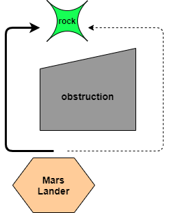<!-- .element width="400px" -->

#### Utility based agent

* will pick the path with the best utility. 
<!-- .element: class="fragment" -->

----

### Environments 

#### Fully versus Partially observable 

* If it is possible to determine the complete state of the environment at each time point from the percepts then it is fully observable
* Otherwise it is only partially observable.
* We have to take into consideration the point of view of the agent since the agent may have limited perception capabilities.

#### Deterministic versus Stochastic 

* If the next state of the environment is completely determined by the current state, and the actions of the agent, then the environment is deterministic
* Otherwise it is non-deterministic.

----

### Environments - continued

#### Episodic versus Sequential:  

* if the choice of current actions is not dependent on previous actions then the enviroment is episodic.
* otherwise it is sequential

#### Car driving

* partially observable
<!-- .element: class="fragment" -->
* stochastic 
<!-- .element: class="fragment" -->
* sequential
<!-- .element: class="fragment" -->

----

### Handling uncertainty

* Uncertainty arises from stochastic nature of environment or due to partial observability
* Agents handle this by keeping track of a belief state - a representation of the set of possible states that environment might be in
* Probability theory allows us to summarize uncertainty as it allows you to characterize the degree of belief in terms of probability of a belief state.
* Bayes theorem: 

$P(A | B) = \frac{P(B|A)P(A)}{P(B)}$. 

* You can think of this as 

$P_{posterior} = \frac{likelihood \cdot prior}{evidence}$ 

----

### Handling uncertainty - example 

* Suppose you have a robot who is _uncertain_ if a door is open or closed
* Robot obtains evidence (or measurement) $e$. Then the posterior probability of the door being open given evidence $e$ is given by
$P(open/e) = \frac{P(e/open)P(open)}{P(e)}$ 
* $P(e/open)$ easier to estimate as you can look at the past observations and estimate the probability density function.

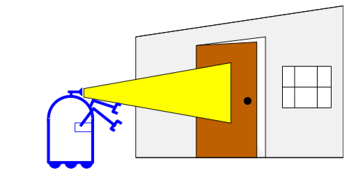<!-- .element width="500px" -->

----

### Decision Theory

* Good decisions must be distinguished from good outcomes.
* To decide, an agent must have **preferences** between the possible **outcomes**
* Preferences are represented by **utility**(or usefulness) i.e. an agent will prefer outcomes with higher utility.
* Probability theory describes what the agent should believe on the basis of evidence.
* Utility theory describes what the agent wants
* Decision theory puts the two together to describe what the agent should do i.e $ = $ Utility Theory + Probability Theory

----

### Decision Networks

* Bayseian networks are used to represent knowledge in an uncertain domain 
* Decision Networks extends Bayesian networks by incorporating actions and utilities.
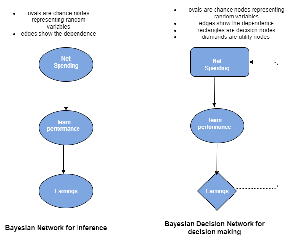<!-- .element width="850px" -->

----

### Decision Networks - continued

* Utility function (denoted U)
	* Quantifies how we **value** outcomes
* Agent's desirability of a state or outcome is captured by an utility function. In Reinforcement Learning (RL) we come across **value function** which is an example of a utility function
* Rational agent will choose an action $a^{*}$ that will maximize the expected utility. Note that we are usually working with estimates of the true expected utility.
	* This is a one-shot or episodic decision.

---

# PART 2/4: Sequential Decisions and MDP 

----

### A Sequential Decision Problem: Maze

<!-- .element width="400px" -->

* Robot is at the "START"
* Agent commands robot with **actions** : UP($\uparrow$),DOWN($\downarrow$),LEFT($\leftarrow$),RIGHT($\rightarrow$) and robot follows exactly
* Agent knows where it is i.e. environment is ***fully observable***
* **state**: where Robot is for e.g. state $S_{42}$ is if robot is in the square with red oval.
* **reward** or punishment received when a state is reached    

----

### Maze - continued

<!-- .element width="400px" -->
* Question: is there any uncertainty? 
	* No - since the actions executed are same as action commands issued and the environment is fully observable
<!-- .element: class="fragment" -->
* Utility of a sequence of states is given by 

$$U(s_0,s_1,...,s_T)=R(s_0)+R(s_1)+...+R(s_T)$$
<!-- .element: class="fragment" -->

* Question: Find sequence of actions from current state to goal (green oval) that maximizes utility?
<!-- .element: class="fragment" -->

----

### MAZE with no uncertainty: Utility 

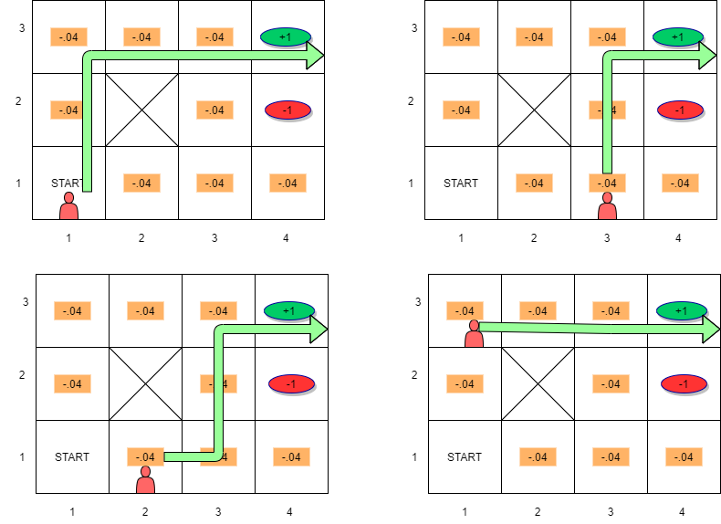 <!-- .element width="800px" -->
* What we are looking for is a **policy** which recommends the action to be taken when in a given state

----

### MAZE with no uncertainty: Policy

<!-- .element width="400px" -->

* **Policy**: $\pi(s) = a$ i.e. $\pi$ function maps state $s$ to action $a$. 

* **Utility** $U(s)$ of state $s$ is the sum of discounted rewards of the sequence of states starting at $s$ generated by using the policy $\pi$ i.e. 

$$U^{\pi}(s) =  R(s) + \gamma R(s_1) + \gamma^{2} R(s_2) + ...$$

----

### MAZE with no uncertainty: Policy  

* **Optimal** policy $\pi$  policy that yields the highest expected utility for the sequence of states generated by $\pi^*$. 

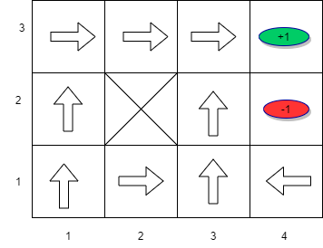<!-- .element width="400px" -->

* For the maze, the optimal policy tells us which action to take so that we are closer to the goal 
  
	* $\pi^*(s_{41})=$ ???
	* $\pi^*(s_{32})=$ ???
	* $\pi^*(s_{11})=$ ???

----

### Markov Decision Process (MDP) 

<!-- .element width="200px" -->
<!-- .element width="700px" -->

* Imagine that the maze environment is stochastic yet fully observable. 
* Due to uncertainty, an action causes transition from state to another state with some probability. There is no dependence on previous states. 
* We now have a sequential decision problem for a fully observable, stochastic environment with Markovian transition model and additive rewards  consisting of:
    * a set of states $S$. State at time $t$ is $s_t$
    * actions  $A$. Action at time $t$ is $a_t$.
    * transition model describing outcome of each action in each state $P( s_{t+1} | s_t,a_t)$ 
    * reward function $r_t=R(s_t)$ 

----

### MDP Transition Model

 

<!-- .element width="500px" -->
<!-- .element width="400px" -->

* Transition Model Graph:
	* Each node is a state.
	* Each edge is the probability of transition

----

### Utility for MDP

 

* Since we have stochastic environment, we need to take into account the transition probability matrix
* Utility of a state is the immediate reward of the state plus the expected discounted utility of the next state due to the action taken  
* **Bellman's Equations**: if we choose an action $a$ then 

$U(s) = R(s) + \gamma \sum_{s^{'}} P(s^{'}| s,a)U(s^{'})$ 

----

### Utility for MDP - continued

<!-- .element width="300px" -->
 
* Suppose robot is in state $S_{33}$ and the action taken is "RIGHT".  Also assume $\gamma = 1$
* We want to compute the utility of this state:
$$ U(S_{33})   =   R(S_{33}) +  \gamma (P(S_{43} | S_{33}, \rightarrow)  U(S_{43}) + P(S_{33} | S_{33}, \rightarrow)  U(S_{33}) + P(S_{32} | S_{33}, \rightarrow)  U(S_{32}))$$
* Substituting we get:

 $$U(S_{33}) = R(S_{33}) + \gamma ( (0.8 \times U(S_{43})) + (0.1 \times U(S_{33})) + (0.1 \times U(S_{23})))$$

----

### Policy for MDP

*  If we choose action $a$ that maximizes future rewards, $U(s)$ is the maximum we can get over all possible choices of actions  and is represented as $U^{*}(s)$.

* We can write this as 
$$U^*(s) = R(s) + \gamma \underset{a}{ \max} (\sum_{s^{'}} P(s^{'}| s,a)U(s'))$$

* The optimal policy (which recommends $a$ that maximizes U) is given by:
  
$$\pi^{*}(s) = \underset{a}{\arg \max}(\sum_{s^{'}} P(s^{'}| s,a)U^{*}(s^{'}))$$

* Can the above $2$ be solved directly? 
  * The set of $|S|$ equations for  $U^*(s)$ cannot be solved directly because they are non-linear due the presence of 'max' function.
  * The set of $|S|$ equations for $\pi^*(s)$ cannot be solved directly as it is dependent on unknown $U^*(s)$.

----

### Optimal Policy for MDP

<!-- .element width="800px" -->

----

### Value Iteration 

* To solve the non-linear equations for $U^{*}(s)$ we use an iterative approach.
* Steps:
	* Initialize estimates for the utilities of states with arbitrary values: $U(s) \leftarrow 0 \forall s \epsilon S$
	* Next use the iteration step below which is also called **Bellman Update**: 

$$U_{t+1}(s) \leftarrow R(s) + \gamma \underset{a}{ \max} \left[ \sum_{s^{'}} P(s^{'}| s,a) U_t(s^{'}) \right] \forall s \epsilon S$$ 

	This step is repeated and updated
* Let us apply this to the maze example.  Assume that $\gamma = 1$

*Initialize value estimates to $0$*

----

### Value Iteration 

* Next we want to apply **Bellman Update**: 
  	$$U_{t+1}(s) \leftarrow R(s) + \gamma \max_{a} \left[\sum_{s^\prime} P(s^\prime | s,a)U_t(s^\prime) \right] \forall s \epsilon S$$
* Since we are taking $\max$ we only need to consider states whose next states have a positive utility value.
* For the remaining states, the utility is equal to the immediate reward in the first iteration.

----

### Value Iteration (t=0)

$$ U_{t+1}(S_{33})  =  R(S_{33}) + \gamma \max_a \left[\sum_{s^{'}} P(s^{'}| S_{33},a)U(s^{'}) \right] \forall s \in S $$

$$ U_{t+1}(S_{33}) =  -0.04 + \max_a \left[ \sum_{s'}  P(s'| S_{33},\uparrow) U_t(s'), \sum_{s'}  P(s'| S_{33},\downarrow)U_t(s'), \sum_{s'}  P(s'| S_{33},\rightarrow) U_t(s'),  \sum_{s'}  P(s'| S_{33}, \leftarrow)U_t(s')  \right]$$

$$U_{t+1}(S_{33})  =  -0.04 + \sum_{s^{'}}  P(s^{'}| S_{33},\rightarrow) U_t(s^\prime) $$

$$U_{t+1}(S_{33}) = -0.04 + P(S_{43}|S_{33},\rightarrow)U(S_{43})+P(S_{33}|S_{33},\rightarrow)U(S_{33})+P(S_{32}|S_{33},\rightarrow)U_t(S_{32}) $$

$$U_{t+1}(S_{33}) =   -0.04 + 0.8 \times 1 + 0.1 \times 0 + 0.1 \times 0 = 0.76 $$

----

### Value Iteration (t=1)

*(A) Initial utility estimates for iteration 2. (B) States with next state positive utility*

$$U_{t+1}(S_{33}) =   -0.04 + P(S_{43}|S_{33},\rightarrow)U_t(S_{43})+P(S_{33}|S_{33},\rightarrow)U_t(S_{33}) +P(S_{32}|S_{33},\rightarrow)U_t(S_{32}) $$

$$U_{t+1}(S_{33}) = -0.04 + 0.8 \times 1 + 0.1 \times 0.76 + 0.1 \times 0 = 0.836$$

$$U_{t+1}(S_{23}) =  -0.04 + P(S_{33}|S_{23},\rightarrow)U_t(S_{23})+P(S_{23}|S_{23},\rightarrow)U_t(S_{23}) = -0.04 + 0.8 \times 0.76 = 0.568$$

$$U_{t+1}(S_{32}) =  -0.04 + P(S_{33}|S_{32},\uparrow)U_t(S_{33})+P(S_{42}|S_{32},\uparrow)U_t(S_{42}) +P(S_{32}|S_{32},\uparrow)U_t(S_{32})$$
$$U_{t+1}(S_{32}) = -0.04 + 0.8 \times 0.76 + 0.1 \times -1 + 0.1 \times 0= 0.468$$

----

### Value Iteration (t=2)

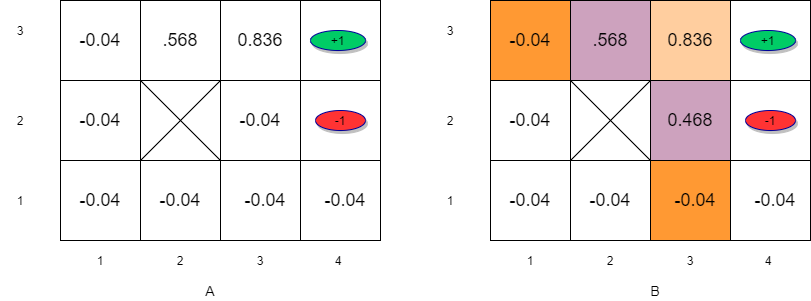
*(A)Initial utility estimates for iteration 3. (B) States with next state positive utility*

* Information propagates outward from terminal states
and eventually all states have correct value estimates 
* Notice that $S_{32}$ has a lower utility compared to $S_{23}$ due to the red oval state with negative reward next to $S_{32}$

----

### Value Iteration - Convergence

* Rate of convergence depends on the maximum reward value and more importantly on the discount factor $\gamma$. 
* The policy that we get from coarse estimates is close to the optimal policy long before $U$ has converged.
* This means that after a reasonable number of iterations, we could use: 
  $$\pi(s) = \argmax_a \left[ \sum_{s^{'}} P(s^{'}| s,a)U_{est}(s^{'}) \right]$$
* Note that this is a form of **greedy** policy.
  
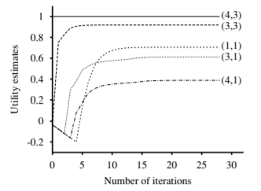
*Convergence of utility for the maze problem (Norvig chap 17)*

* For the maze problem, convergence is reached within 5 to 10  iterations

----

### Policy Iteration

* Alternates between two steps:
	 * Policy evaluation: given a policy, find the utility of states
	 * Policy improvement: given the utility estimates so far, find the best policy
* The steps are as follows:

	1. Compute utility/value of the policy $U^{\pi}$ 
	2. Update $\pi$ to be a greedy policy w.r.t. $U^{\pi}$: 
   $$\pi(s) \leftarrow \arg\max_a \sum_{s^\prime} P(s^\prime|s,a)U^{\pi}(s^\prime)$$
	3. If the policy changed then return to step $1$

* Policy improves each step and converges to the optimal policy $\pi^{*}$ 

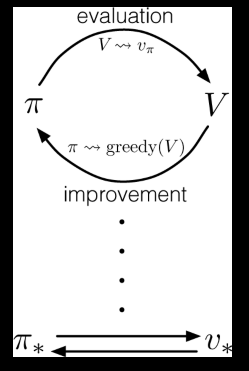<!-- .element width="225px" -->

----

### Policy Iteration for Grid World

* Let us consider another grid world example.
  

* The terminal states are shaded. The reward is $-1$ on all transitions until the terminal states are reached. The non-terminal states are $S_1,S_2,...,S_{14}$.

* We begin with random values (or utilities) and random policy $\pi$

*Initial values and policy for policy iteration*

----

### Policy Iteration (Step 1)

* Find value function based on initial random policy: 

$$U(s) = R(s) + \sum_{s^\prime} P(s^\prime| s,a)U(s^\prime)$$

$$U(S_{1}) = -1 + \frac{1}{4}U(S_{1}) + \frac{1}{4}U(S_{2}) + \frac{1}{4}U(S_{5}) = -1$$ 
$$\ldots$$
$$ U(S_{9}) = -1 + \frac{1}{4}U(S_{8}) + \frac{1}{4}U(S_{5}) + \frac{1}{4}U(S_{13}) + \frac{1}{4}U(S_{10}) = -1$$
$$ \ldots $$

* The result is as shown below:

----

### Policy Iteration (step 2)

* Next we compute the policy:

$$ \pi(S_{4}) =   \underset{a}{max}[\frac{1}{4}U(S_{term})| \uparrow, 
  \frac{1}{4}U(S_5)| \rightarrow, 
  \frac{1}{4}U(S_4)| \leftarrow, 
  \frac{1}{4}U(S_8), \downarrow] = \uparrow $$

$$\pi(S_{6}) =  \underset{a}{max}[\frac{1}{4}U(S_2)| \uparrow, 
\frac{1}{4}U(S_7)| \rightarrow, 
 \frac{1}{4}U(S_5)| \leftarrow, 
\frac{1}{4}U(S_{10}), \downarrow ] = \mathtt{random\ policy} $$

* The result is shown below for $k=2$.  

---
 
# PART 3/4: POMDPs 

----

### Partially Observable MDPs

* We considered "uncertainty" in the action outcome previously. Now, the environment is partially observable. 
* We now deal with a **belief** state which is the agent's current belief about the state that it is in. 

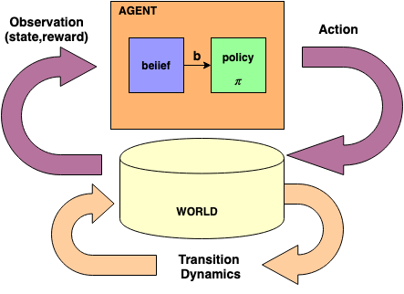

----

### POMDP Parameters

* The MDP parameters we listed previously continue to hold for POMDP:
    * a set of states $S$. State at time $t$ is $s_t$
    * actions  $A$. Action at time $t$ is $a_t$.
    * transition model describing outcome of each action in each state $P( s_{t+1} | s_t, a_t)$ 
    * reward function $r_t=R(s_t)$ 
* Additional POMDP parameters:
	* initial belief of state $s$: $b(s)=P(s)$
	* if $b(s)$ was the previous belief state, agent does an action $a$ then perceives evidence $e$ then the new belief state is given by: 
  	$$b^\prime(s^\prime) = P(s^\prime | e,a,b)$$
	* observation probability: $P(e|s^{'},a)$
* The belief state $b$ also satisfies the Markov property

----

### POMDP versus other models
 

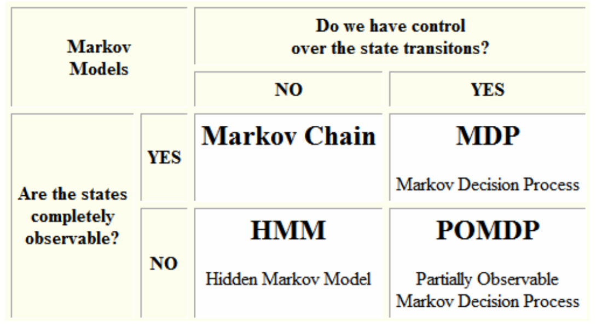
[source](https://www.cs.cmu.edu/~ggordon/780-fall07/lectures/POMDP_lecture.pdf)

----

### POMDP Example

* We want to find the optimal policy...i.e. what is the best action the person should take?

----

### POMDP Example - Transition Probabilities

* The "Listen" action does not change the tiger location

| $P(s^{'}$\| $s, Listen)$ | TL | TR |
|-----------------|---|--|
| TL | 1.0 | 0 |
| TR | 0   | 1.0|

* The "open-left" or "open-right" action resets the problem in which case the tiger can be on the left or right with equal probability

|$P(s^{'}$\| $s, open-right)$ | TL | TR |
|-----------------|---|--|
| TL | 0.5 | 0 |
| TR | 0   | 0.5|

|$P(s^{'}$ \| $s, open-left)$  | TL | TR |
|-----------------|---|--|
| TL | 0.5 | 0 |
| TR | 0   | 0.5|

----

### POMDP Example - Observation Probabilities

* Only the "Listen" action is informative 

|$P(e$ \| $s, Listen)$ | TL | TR |
|-----------------|---|--|
| TL | 0.85 | 0.15 |
| TR | 0.15   | 0.85 |

* Any observation without the "listen" action is uninformative

|$P(e$ \| $s, open-right)$  | TL | TR |
|-----------------|---|--|
| TL | 0.5 | 0 |
| TR | 0   | 0.5|

|$P(e$ \| $s, open-left)$ | TL | TR |
|-----------------|---|--|
| TL | 0.5 | 0 |
| TR | 0   | 0.5|

----

### POMDP Example - Immediate Rewards 

* "Listen" action results in a small penalty 

| $R(s)$ \| $Listen$ |   |
|-----------------|----|
| TL | -1 | 
| TR | -1 |

* Opening the wrong door results in large penalty 

|$R(s)$ \| $open-left$ |  |
|-----------------|---|
| TL | -100 |
| TR | +10 |

|$R(s)$ \| $open-right$ |  |
|-----------------|---|
| TL | +10 | 
| TR | -100   |

#### Belief State Space

* b(left) versus b(right)

----

### POMDP as a Belief-state MDP

* Solving a POMDP on a physical state space reduces to solving an MDP on the corresponding belief-state space
* The resulting MDP has a **high dimensional continuous**(typically in real world problems) belief state space  which makes it more difficult to solve
* Approach to solving this:
	* Each policy is a plan conditioned on belief $b$ 
	* Each conditional plan is a hyperplane
	* Optimal policy then is the conditional plan with the highest expected utility
	* The optimal action depends only on the agents's current belief state. That is, the optimal policy $\pi^{*}(b)$ maps from belief states to actions.
	* The decision cycle in this case would comprise of the following $3$ steps:
		* Given the current belief state, execute the action $a=\pi^{*}(b)$
		* Receive percept $e$
		* Set the current belief state to $b^{'}(s^{'})$ given by 
  $$b^{'}(s^{'}) = \alpha P(e|s^{'}) \sum_{s} P(s^{'}|s,a)b(s)$$

----

### Solving POMDP

* The value iteration approach for POMDP looks something like this:
  
$$U_{t+1}(b) \leftarrow \max_{a}[ \sum_s b(s)R(s,a) +\gamma \sum_eP(e|b,a)U(\tau(e,b,a)]$$ 

where $\tau(e,b,a)$ is the transition function for the belief state.

* This is in general very hard to solve as it is a continuous space MDP
* Instead one resorts to exploiting special properties in terms of 
	* Policy Tree
	* Piecewise linear and convex property of the value function

----

### Solving the tiger problem - 1-step horizon

* Suppose that you were told the $b(left) = \rho = 0.5$ i.e. tiger could be either on the left or right with equal probability.
* **You are told that you have only 1 chance to take an action, what would that be and why?**

*The Tiger Problem*

----

### Solving the tiger problem - 1-step horizon

* Determine expected utility for each possible action for different belief distributions

| action | expected utility for  $\rho=0.5$ |expected utility for $\rho=0.4$| 
|--------|------------------|----------|
|LEFT    | $0.5 \times -100 + 0.5 \times 10 = -45$ | $0.4 \times -100 + 0.6 \times 10 = -36$|
|RIGHT   |$-45$ | $0.6 \times -100 + 0.4 \times 10 = -56$|
|LISTEN |$-1$| $-1$ |

* For the above cases, we would pick "listen" as it has the highest expected utility 
* How low should $\rho$ go so that the utility of picking "left" is better than picking "listen"
	* Find $x \ni \rho \times -100 + (1-\rho) \times 10 \lt -1$
	* Solving we get $\rho \lt 0.1$. This means that if that if $0 \lt b(left) \lt 0.1$ then choose "left. This range is called the **belief interval** for which we would select "left".
	* Based on the above analysis, the optimal 1 step policy is as below 

----

### Solving the tiger problem - t-step horrizon

* The value function of POMDPs can be represented as max of linear segments

* How about if you were given $2$ chances? i.e. $t=2$ and $b(left)=0.5$.
	* It turns out that the optimal policy for the first step is to always "listen". 
	* The reason is that if you opened the door on the first step
		* the tiger would be randomly placed behind one of the doors and the agent's belief state would be reset to $(0.5, 0.5)$. 
		* The agent would be left with no information about the tiger's location and with one action remaining.

----

### Solving the tiger problem - t-step horrizon

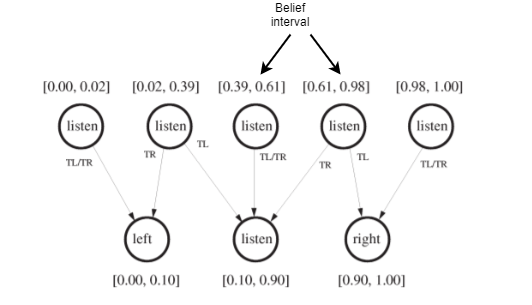
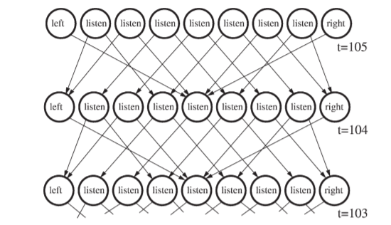

---

# PART 4/4: Reinforcement Learning (RL)

NOTE: Reinforcement Learning and Deep RL (DRL) are covered in Lecture 9. 

----

### Introduction

* Reinforcement learning is concerned with solving sequential decision problems.
* Many real world problems fall into this category e.g. playing video games, driving, robotic control etc.
* **_Reinforcement learning might be considered to encompass all of AI: an agent is placed in an environment and must learn to behave therein_**
* The goal of reinforcement learning is to use observed rewards to learn the optimal (or close to optimal) policy for the environment.
* So far we have been looking at solving sequential decision making problems but we have assumed a complete model of the environment  and the reward function
* Can we **learn** directly from experiences in the world?
	* Must receive feedback for good/bad experiences
	* Called rewards or **reinforcement** 
	* One assumption that we make is that the reward input is known i.e. we know that a particular sensory input corresponds to reward

----

### Learning

* An agent is learning if it improves its performance on future tasks after making observations about the world.
* What is learned:
	 * mapping from state to action
	 * utility information indicating desirability of states
	 * action-value information about the desirability of actions
	 * goals that describe states whose achievement maximize agent's utility
* Feeback types used that determine three types of learning 
	*  observes *patterns* in input without explicit feedback - unsupervised learning
	* *reinforcements* i.e. rewards or punishments - reinforcement learning
	* observes example input-output pairs and learns the mapping functions - supervised learning

----

### Utility, Value, Action-Value, Action-Utility, Q functions

* **Utility function**: $U^{\pi}(s)$ provide expected utility or return or reward of a state by executing a given policy $\pi$
* **Value function**: $V^{\pi}=U^{\pi}(s)$  
* **Action-utility function**: $U^{\pi}(s,a)$ gives the expected utility by taking an action $a$ while in state $s$
* **Action-value function**: $V^{\pi}(s,a)=U^{\pi}(s,a)$
* **Q-function**: $Q^{\pi}(s,a)=V^{\pi}(s,a)=U^{\pi}(s,a)$
* You get the value function by taking the expection of the action-value function over the set of actions i.e. $V^{\pi}(s) = \underset{a}{E}[Q(s,a)]$

----

### Reinforcement Learning 
* Reinforcement learning is learning what to do i.e. how to map situations to actions so as to maximize a numerical reward signal. The learner must discover which actions yield the most reward by trying them. 
* These two characteristics: **trial\-and\-error** search and **delayed reward** are the two most important distinguishing features of reinforcement learning.
* There is a feedback control loop where agent and environment exchange signals while the agent tries to maximize the rewards or objective.
* Signal exchanged at any time $t$ is $(s_t,a_t,r_t)$  which correspond to the state, action and reward at time $t$. This tuple is called an _experience_.

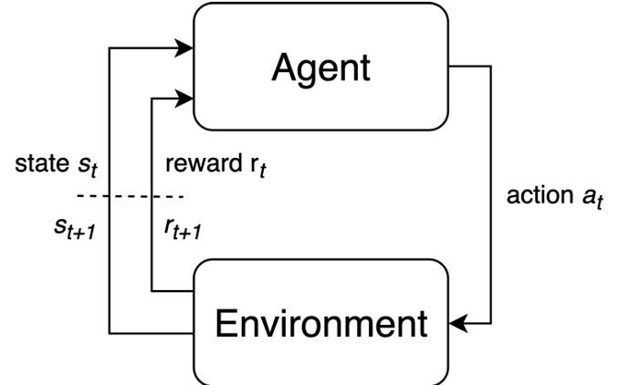<!-- .element width="450px" -->

----

### Reinforcement Learning as MDP

* Reinforcement learning can be formulated as an MDP with the following parameters:
	* transition function ( $ P(s_{t+1} | s_t,a_t) $ ) captures how the enviroment transitions from one state to the next and is formulated as MDP
	* reward function  ( $ R(s_t,a_t,a_{t+1}) $ )
	* set of actions $ A $
	* set of states $ S $ 
* One important assumption in the above formulation is that the agent does not have access to the transition or reward function 
* Functions to be learning in RL
	* policy $\pi$ 
	* value function $V^{\pi}$  or action value function $Q^{\pi}(s,a)$
	* environment model $P(s^{'} | s,a)$

----

### Deep RL
* use neural networks as function approximators to learn the functions
* **Policy-based methods**
	* learn policy $\pi$ to maximize objective
	* PROS
		* general class of optimization methods
		* any type of actions: discrete, continous or a mix
		* guaranteeed to converge(locally) for e.g. via Poilcy Gradient Algorithm
	* CONS
		* high variance
		* sample inefficient

----

### Deep RL - **Value Based Methods** 

* agent learns either $V^{\pi}(s)$ or $Q^{\pi}$
* uses the learnt function(s) to generate the policy for e.g. greedy policy
* generally $Q^{\pi}(s,a)$ is preferred as agent can select the action when in a given state to maximize the objective
* PROS:
	* more sample efficient than policy based algorithms
* CONS
	* no guarantee of convergence to optimal policy
	* most methods are for discrete action spaces though recently QT-OPT has been proposed which can handle continuous spaces

----

### Deep RL - **Model Based Methods** 

* agent learns a model of the environment dynamics
* using this model, agent can imagine or predict what will happen if a set of actions are taken for few time steps without actually changing the environment
* Based on these predictions, agent can figure out the best actions
* PROS:
	* gives agent foresight
	* tend to require fewer samples
* CONS:
	* learning the model can be difficult as typically real world environments can have a large state and action space
	* predictions depend on the accuracy of the model 

----

### Taxonomy of RL algorithms

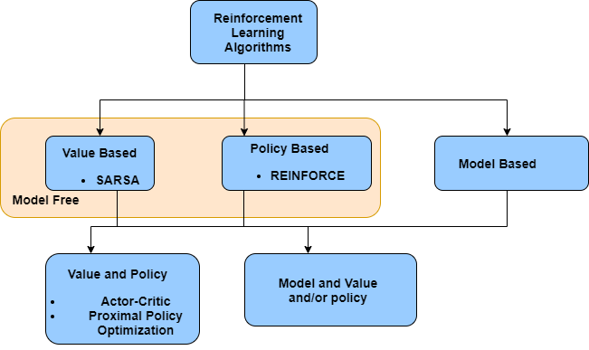<!-- .element width="800px" -->

----

### Off policy versus on policy

* On policy
	* e.g. SARSA
	* agent learns on the policy i.e. training data generated from the current poicy is used
	* in other words agent is learning the value of the policy that is being followed 
	* after the agent is trained, data is discarded and the iterated policy is used.
	* sample inefficent due to the discarding of data but memory efficient
* Off policy
	* e.g. Q-learning
	* any data collected can be used for training 
	* the value of a policy that is different from the one being followed is being learnt
	* more memory may be required to store data

----

### Deep Learning 

* Neural networks learn functions $f_{\theta}(x)$ which map input $x$ to output $y$. The weights of the neural network are represented by $\theta$.
	* if $y=f(x)$ then learnt $f_{\theta}(x)$ is the estimate for $f(x)$
	* Loss function $L(f_{\theta}(x),y)$ captures the difference between the target $y$ and the predicted network output $f_{\theta}(x)$. This loss function needs to be minimized.
	* generally we have training data samples which are independent and identically distributed (iid)
* Changing the weights will corresponding to different mapping functions.
* Increasing number of nodes in a layer or layers allows learning of more complex functions
* In reinforcement learning: 
	* neither $x$ or $y$ are known in advance
	* instead these values are obtained through agent interactions with environment - where it observes states and rewards
	* reward functions are the main source of feedback and the rewards are quite sparse
	* since current state and actions that an agent takes affect the future states, the iid assumption between samples for neural network training no longer holds and this affects the rate of convergence.

----

#### Case Study - World Models

* Goal is to learn from pixels and control a car on a racing track

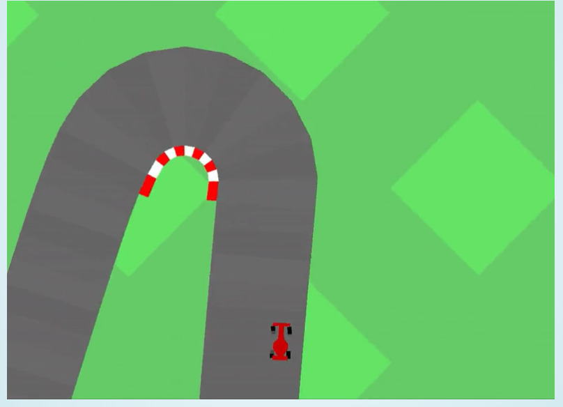<!-- .element width="600px" -->

source: https://worldmodels.github.io/ 

----

#### Case Study - World Models - continued

* Model based reinforcement learning 
* vision + memory + control

<!-- .element width="900px" -->

source: https://worldmodels.github.io/ 

----

#### Case Study - World Models - continued

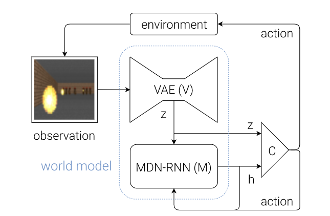<!-- .element width="900px" -->

----

#### Case Study - World Models - continued

<video data-autoplay src="./images/carracing_mistake_short.mp4"></video>

---

# THANK YOU!!!!
