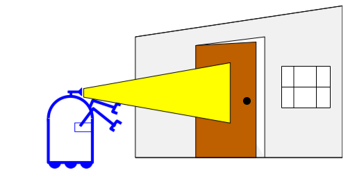
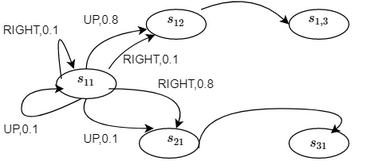
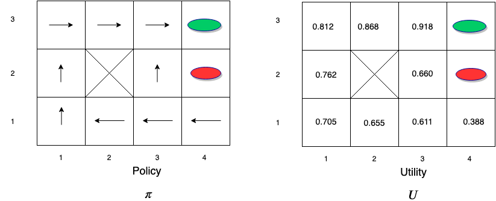
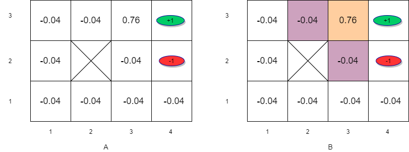
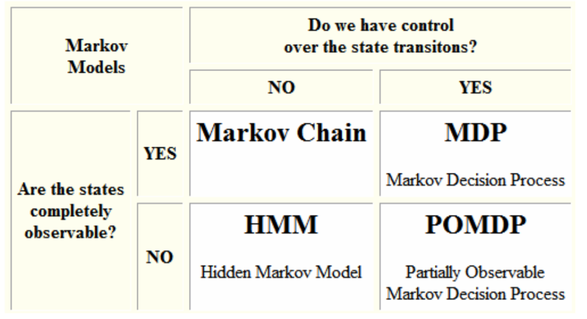
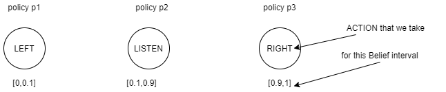
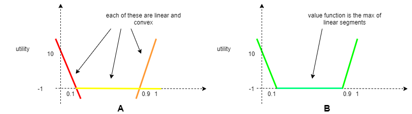
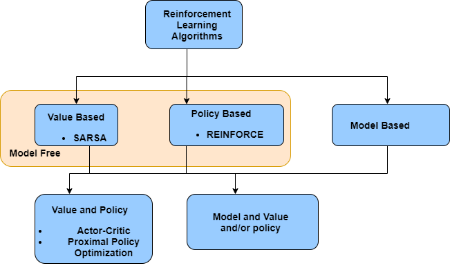

# Lecture 8 
## Gurudutt Hosangadi, Bell Labs, NJ
## April 6th, 2020

Note:
- Career spans about 20 years mostly in wireless research
- Used Deep Learning to model user scheduling algorithms
- more recently ML in computer vision and reinforcement learning in the context of robotic arm manipulation

---

## PLAN

* Review
* Sequential Decisions and MDP
* POMDPs
* Reinforcement Learning   

Note:
- the plan for today is to consider a very important class of problems that we encounter frequently in the real world: sequential decision problems. When you will go to get your coffee during our break, you will be taking a sequence of decisions
- We will look at how to model such problems as Markov Decision Processes.
- Often the environment is fully observable in which case we will have to understand Partially Observeble MDPs
- We now have some foundation to understand the concepts of reinforcement learning.
- By the end of the lecture hoping that you will have understood the basic concepts that will get you ready for study of RL algorithms in detail in the subsequent lecture

---

# Part 1/4: REVIEW

Note:
we begin with review

----

### Agents

An agent is anything that can perceive an **environment** through sensors and then **act** on the environment. An agent therefore maps **percepts** into **actions**.

### Agent Types

$4$ main categories depending on how percepts are mapped to actions:
* **Simple reflex agent**: selects an action based on current percept
* **Model based reflex agent**: uses current perspect and a model of the world to take action
* **Goal based agent**:  uses current perspective, a model of the world and set of goals it is trying to achieve to take action
* **Utility based agent**: uses current perspective, a model of the world, set of goals it is trying to achieve and utility of outcomes to take action

Note:
- agent types are going in increasing order of complexity (and artifical intelligence) 
- let us take a look at an example

----

### Example: Mars lander

Suppose that the mars lander needs to pick up 1 sample of each different looking rock. There could be obstructions along the way.

<!-- .element width="500px" -->

**What would be the outcome of the different types of agents?**

----

### Mars Lander - continued

#### Simplex reflex agent 

* if the Lander found a rock in a specific place it needed to collect then it would collect it. 
<!-- .element: class="fragment" -->
* if it found the same rock in a different place it would still pick it up as it doesn't take into account that it already picked it up. 
<!-- .element: class="fragment" -->

#### Model based reflex agent 

* this time the Lander after picking up its first sample, stores this information in its model so when it comes across the second same sample it passes it by.
<!-- .element: class="fragment" -->

Note:
- model based agent uses percept history and internal memory to make decisions

----

### Mars lander - continued

Assume that the Lander comes across an obstruction.

<!-- .element width="400px" -->

#### Goal-based agent 

* it is not clear which path will be taken by the agent which may take a longer path and still reach the goal of picking up the rock.

<!-- .element: class="fragment" -->

----

### Mars lander - continued

<!-- .element width="400px" -->

#### Utility based agent

* will pick the path with the best utility. 
<!-- .element: class="fragment" -->

Note:
- the shorter path will take less time, conserve battery and other resources and so this the path the lander will execute
- our interest today will be on the utility based agent

----

### Environments 

#### Fully versus Partially observable 

* If it is possible to determine the complete state of the environment at each time point from the percepts then it is fully observable
* Otherwise it is only partially observable.
* We have to take into consideration the point of view of the agent since the agent may have limited perception capabilities.

#### Deterministic versus Stochastic 

* If the next state of the environment is completely determined by the current state, and the actions of the agent, then the environment is deterministic
* Otherwise it is non-deterministic.

Note:
- important to understand the type of environment for the problem at hand
- only going through the types relevant for today's lecture

----

### Environments - continued

#### Episodic versus Sequential:  

* if the choice of current actions is not dependent on previous actions then the enviroment is episodic.
* otherwise it is sequential

#### Car driving

* partially observable
<!-- .element: class="fragment" -->
* stochastic 
<!-- .element: class="fragment" -->
* sequential
<!-- .element: class="fragment" -->

Note:
- car driving:
	- partially observable because you cannot see around the corner
	- stochastic since people may randomly be walking. Can think of them as other agents with their own goal in mind 
	- sequential because there is dependency between actions
- When we deal with stochastic environments, there is uncertainty and we have have a way to deal with this

----

### Handling uncertainty

* Uncertainty arises from stochastic nature of environment or due to partial observability
* Agents handle this by keeping track of a belief state - a representation of the set of possible states that environment might be in
* Probability theory allows us to summarize uncertainty as it allows you to characterize the degree of belief in terms of probability of a belief state.
* Bayes theorem: 

$P(A | B) = \frac{P(B|A)P(A)}{P(B)}$. 

* You can think of this as 

$P_{posterior} = \frac{likelihood \cdot prior}{evidence}$ 

Note:
- mathematical framework that we use to handle uncertainty is probability theory
- elements on the right are more easy to determine

----

### Handling uncertainty - example 

* Suppose you have a robot who is _uncertain_ if a door is open or closed
* Robot obtains evidence (or measurement) $e$. Then the posterior probability of the door being open given evidence $e$ is given by
$P(open/e) = \frac{P(e/open)P(open)}{P(e)}$ 
* $P(e/open)$ easier to estimate as you can look at the past observations and estimate the probability density function.

<!-- .element width="500px" -->

Note:
- robot does not know if the door is currently open but based on past evidence can determine this probability
- Next:
	- now that we have a way to deal with uncertainty, we need to have a framework to make decisions

----

### Decision Theory

* Good decisions must be distinguished from good outcomes.
* To decide, an agent must have **preferences** between the possible **outcomes**
* Preferences are represented by **utility**(or usefulness) i.e. an agent will prefer outcomes with higher utility.
* Probability theory describes what the agent should believe on the basis of evidence.
* Utility theory describes what the agent wants
* Decision theory puts the two together to describe what the agent should do i.e $ = $ Utility Theory + Probability Theory

Note:
- Next
	- how do represent this?
	- we use bayesian networks and baysesian decision networks 

----

### Decision Networks

* Bayseian networks are used to represent knowledge in an uncertain domain 
* Decision Networks extends Bayesian networks by incorporating actions and utilities.
<!-- .element width="850px" -->

Note:
- Example of a soccer team where net spending impacts team performance which impacts net earnings.
	- on left we have a bayesian network
		- ovals are chance nodes representing random variables
		- edges show dependency
	- on right we have a bayesian decision network
		- diamonds are utility and rectangles are decision nodes

----

### Decision Networks - continued

* Utility function (denoted U)
	* Quantifies how we **value** outcomes
* Agent's desirability of a state or outcome is captured by an utility function. In Reinforcement Learning (RL) we come across **value function** which is an example of a utility function
* Rational agent will choose an action $a^{*}$ that will maximize the expected utility. Note that we are usually working with estimates of the true expected utility.
	* This is a one-shot or episodic decision.

Note:
- skip this slide

---

# PART 2/4: Sequential Decisions and MDP 

----

### A Sequential Decision Problem: Maze

<!-- .element width="400px" -->

* Robot is at the "START"
* Agent commands robot with **actions** : UP($\uparrow$),DOWN($\downarrow$),LEFT($\leftarrow$),RIGHT($\rightarrow$) and robot follows exactly
* Agent knows where it is i.e. environment is ***fully observable***
* **state**: where Robot is for e.g. state $S_{42}$ is if robot is in the square with red oval
* **reward** or punishment received when a state is reached    

Note:
- 4x3 maze
- 2 terminal states 
- every additional step that the robot takes to reach the preferred terminal state costs the robot 

----

### Maze - continued

<!-- .element width="400px" -->
* Question: is there any uncertainty? 
	* No - since the actions executed are same as action commands issued and the environment is fully observable
<!-- .element: class="fragment" -->
* Utility of a sequence of states is given by $U(s_0,s_1,...,s_T)=R(s_0)+R(s_1)+...+R(s_T)$ 
<!-- .element: class="fragment" -->
* Question: Find sequence of actions from current state to goal (green oval) that maximizes utility?
<!-- .element: class="fragment" -->

Note:
- draw with pen to 2 possible paths 

----

### MAZE with no uncertainty: Utility 

 <!-- .element width="800px" -->
* What we are looking for is a **policy** which recommends the action to be taken when in a given state

----

### MAZE with no uncertainty: Policy

<!-- .element width="900px" -->
<!-- .element width="400px" -->

* **Policy**: $\pi(s) = a$ i.e. $\pi$ function maps state $s$ to action $a$. 
* **Utility** $U(s)$ of state $s$ is the sum of discounted rewards of the sequence of states starting at $s$ generated by using the policy $\pi$ i.e. $U^{\pi}(s) =  R(s) + \gamma R(s_1) + \gamma^{2} R(s_2) + ...$

Note:
- Figure is showing 2 different policies
- one issue with utility equation on previous slide is that it is not bounded
- use discount factor to keep it bounded

----

### MAZE with no uncertainty-Policy  

* **Optimal** policy $\pi^{\*}$ : policy that yields the highest expected utility for the sequence of states generated by $\pi^*$. 
<!-- .element width="400px" -->
* For the maze, the optimal policy tells us which action to take so that we are closer to the goal 
	* **$\pi^*(s_{41})=$ ???**
	* **$\pi^*(s_{32})=$ ???**
	* **$\pi^*(s_{11})=$ ???**

Note:
- optimal policy for s41 is "left", for s32 is up, for s11 is up
- note that for s11, could also go right
- Next
	- we will now introduce some uncertainty

----

### Markov Decision Process (MDP) 

<!-- .element width="200px" -->
<!-- .element width="700px" -->

* Imagine that the maze environment is stochastic yet fully observable. 
* Due to uncertainty, an action causes transition from state to another state with some probability. There is no dependence on previous states. 
* We now have a sequential decision problem for a fully observable, stochastic environment with Markovian transition model and additive rewards  consisting of:
    * a set of states $S$. State at time $t$ is $s_t$
    * actions  $A$. Action at time $t$ is $a_t$.
    * transition model describing outcome of each action in each state $P( s_{t+1} | s_t,a_t)$ 
    * reward function $r_t=R(s_t)$ 

----

### MDP Transition Model

 
<!-- .element width="500px" -->
<!-- .element width="400px" -->

* Transition Model Graph:
	* Each node is a state.
	* Each edge is the probability of transition

Note:
- figure on the left shows the general case of a Markov Decision Process where the agent senses the environment and gets an observation/reward. It then takes an action which impacts the environment. The state of the environment changes through a transition model
- figure in the middle shows the transition between states. For example if you are in S12 and up action is taken then you can go right or left each with probability 0.1

----

### Utility for MDP

 

* Since we have stochastic environment, we need to take into account the transition probability matrix
* Utility of a state is the immediate reward of the state plus the expected discounted utility of the next state due to the action taken  
* **Bellman's Equations**: if we choose an action $a$ then 

$U(s) = R(s) + \gamma \sum_{s^{'}} P(s^{'}| s,a)U(s^{'})$ 

Note:
- recall that we are interested in a utility based agent
- so we need to understand how to compute the utility of states
- the summation over states arises from the uncertainty when an action is taken
- note that bellmans equations dependency on action taken
- Next
	- specific example

----

### Utility for MDP - continued

<!-- .element width="300px" -->
 

* Suppose robot is in state $S_{33}$ and the action taken is "RIGHT".  Also assume $\gamma = 1$
* We want to compute the utility of this state:
\begin{eqnarray\*}
U(S_{33})   & = &  R(S_{33}) +  (P(S_{43} | S_{33}, \rightarrow)  U(S_{43}) + P(S_{33} | S_{33}, \rightarrow)  U(S_{33}) \\\\
& & + P(S_{32} | S_{33}, \rightarrow)  U(S_{32}))
\end{eqnarray\*}
* Substituting we get:

 $U(S_{33}) = R(S_{33}) + \gamma ( (0.8 \times U(S_{43})) + (0.1 \times U(S_{33})) + (0.1 \times U(S_{23})))$

Note:
- this example shows how to setup the equation for the utility of a state based on the known transition model and immediate rewards
- typically you will end with $|S|$ number of equations with $|S|$ unknowns. We will see one example later. 
- Next
	- now that we have looked at utility, let us look at the policy

----

### Policy for MDP

*  if we choose action $a$ that maximizes future rewards, $U(s)$ is the maximum we can get over all possible choices of actions  and is represented as $U^{*}(s)$.
* We can write this as $U^{*}(s) = R(s) + \gamma \underset{a}{ \max} (\sum_{s^{'}} P(s^{'}| s,a)U(s^{'}))$
* The optimal policy (which recommends $a$ that maximizes U) is given by:
$\pi^{\*}(s) = \underset{a}{\arg \max}(\sum_{s^{'}} P(s^{'}| s,a)U^{\*}(s^{'}))$
* Can the above $2$ be solved directly?
	* The set of $|S|$ equations for  $U^{\*}(s)$ cannot be solved directly because they are non-linear due the presence of 'max' function.
<!-- .element: class="fragment" -->
	* The set of $|S|$ equations for $\pi^{\*}(s)$ cannot be solved directly as it is dependent on unknown $U^{\*}(s)$.
<!-- .element: class="fragment" -->

Note:
- Next
	- resulting optimal policy

----

### Optimal Policy for MDP

<!-- .element width="800px" -->

Note:
- it turns out that the optimal policy and utilities for the states are as shown here.
- let us learn how to get these both

----

### Value Iteration

* To solve the non-linear equations for $U^{*}(s)$ we use an iterative approach.
* Steps:
	* Initialize estimates for the utilities of states with arbitrary values: $U(s) \leftarrow 0 \forall s \epsilon S$
	* Next use the iteration step below which is also called **Bellman Update**: $U_{t+1}(s) \leftarrow R(s) + \gamma \underset{a}{ \max} (\sum_{s^{'}} P(s^{'}| s,a)U(s^{'})) \forall s \epsilon S$. This step is repeated and updated
* Let us apply this to the maze example.  Assume that $\gamma = 1$

<!-- .element: class="fragment" -->

----

## Value Iteration - continued

* Next we want to apply **Bellman Update**: $U_{t+1}(s) \leftarrow R(s) + \gamma max_{a} (\sum_{s^{'}} P(s^{'}| s,a)U(s^{'})) \forall s \epsilon S$.
* Since we are taking $max$ we only need to consider states whose next states have a positive utility value.
* For the remaining states, the utility is equal to the immediate reward in the first iteration.

----

### Value Iteration - continued

\begin{eqnarray\*}
    U_{t+1}(S_{33}) & \leftarrow & R(S_{33}) + \gamma max_{a} (\sum_{s^{'}} P(s^{'}| S_{33},a)U(s^{'})) \forall s \epsilon S \\\\
     & \leftarrow & -0.04 + \max [\sum_{s^{'}}  P(s^{'}| S_{33},\uparrow)U(s^{'}),\sum_{s^{'}}  P(s^{'}| S_{33},\downarrow)U(s^{'}),  \\\\
& & \sum_{s^{'}}  P(s^{'}| S_{33},\rightarrow)U(s^{'}),\sum_{s^{'}}  P(s^{'}| S_{33},\leftarrow)U(s^{'})] \\\\
    & \leftarrow &  -0.04 + \sum_{s^{'}}  P(s^{'}| S_{33},\rightarrow)U(s^{'}) \\\\
& \leftarrow & -0.04 + P(S_{43}|S_{33},\rightarrow)U(S_{43})+P(S_{33}|S_{33},\rightarrow)U(S_{33}) \\\\
& & +P(S_{32}|S_{33},\rightarrow)U(S_{32}) \\\\
 & \leftarrow &  -0.04 + 0.8 \times 1 + 0.1 \times 0 + 0.1 \times 0 = 0.76
\end{eqnarray\*}

Note:
- Next
	- next iteration

----

### Value Iteration - continued

<!-- .element width="600px" -->

\begin{eqnarray\*}
    U_{t+1}(S_{33}) & \leftarrow &   -0.04 + P(S_{43}|S_{33},\rightarrow)U(S_{43})+P(S_{33}|S_{33},\rightarrow)U(S_{33}) \\\\
& & +P(S_{32}|S_{33},\rightarrow)U(S_{32}) \\\\
 & \leftarrow &  -0.04 + 0.8 \times 1 + 0.1 \times 0.76 + 0.1 \times 0 = 0.836 \\\\
    U_{t+1}(S_{23}) & \leftarrow &   -0.04 + P(S_{33}|S_{23},\rightarrow)U(S_{23})+P(S_{23}|S_{23},\rightarrow)U(S_{23}) \\\\
   & \leftarrow & = -.04 + 0.8 \times 0.76 = 0.568 \\\\
    U_{t+1}(S_{32}) & \leftarrow &  -0.04 + P(S_{33}|S_{32},\uparrow)U(S_{33})+P(S_{42}|S_{32},\uparrow)U(S_{42}) \\\\
& & +P(S_{32}|S_{32},\uparrow)U(S_{32}) \\\\
  & \leftarrow & = -0.04 + 0.8 \times 0.76 + 0.1 \times -1 + 0.1 \times 0= 0.468 
\end{eqnarray\*}

----

### Value Iteration - continued

<!-- .element width="700px" -->

* Information propagates outward from terminal states
and eventually all states have correct value estimates 
* Notice that $S_{32}$ has a lower utility compared to $S_{23}$ due to the red oval state with negative reward next to $S_{32}$

<!-- .element width="600px" -->

----

### Value Iteration - Convergence

* Rate of convergence depends on the maximum reward value and more importantly on the discount factor $\gamma$. 
* The policy that we get from coarse estimates is close to the optimal policy long before $U$ has converged.
* This means that after a reasonable number of iterations, we could use: $\pi(s) = argmax_{a}(\sum_{s^{'}} P(s^{'}| s,a)U_{est}(s^{'}))$
* Note that this is a form of **greedy** policy.
<!-- .element width="400px" -->
* For the maze problem, convergence is reached within 5 to 10  iterations

Note:
- in bullet 3 note that all we have is an estimate. Point this out with a pen

----

### Policy Iteration
* Alternates between two steps:
	 * Policy evaluation: given a policy, find the utility of states
	 * Policy improvement: given the utility estimates so far, find the best policy
* The steps are as follows:
	1. Randomly initialize the policy $\pi$
	2. Compute utility/value of the policy $U^{\pi}$(by solving a system of linear equations)
	3. Update $\pi$ to be a greedy policy w.r.t. $U^{\pi}$: $\pi(s) \leftarrow \underset{a}{\arg\max} \sum_{s^{'}} P(s^{'}|s,a)U^{\pi}(s^{'})$
	4. If the policy changed then return to step $2$
* Policy improves each step and converges to the optimal policy $\pi^{*}$ 
<!-- .element width="225px" -->

----

### Policy Iteration for Grid World

* Let us consider another grid world example.
<!-- .element width="700px" -->
* The terminal states are shaded. The reward is $-1$ on all transitions until the terminal states are reached. The non-terminal states are $S_1,S_2,...,S_{14}$.
* We begin with random values (or utilities) and random policy

Note:
- 4x4 maze
- random policy here means that from any state we can choose any action

----

### Policy Iteration - continued

* Find value function based on initial random policy: $U(s) = R(s) + \sum_{s^{'}} P(s^{'}| s,a)U(s^{'})$ 
\begin{eqnarray\*}
U(S_{1}) & = -1 + \frac{1}{4}U(S_{1}) + \frac{1}{4}U(S_{2}) + \frac{1}{4}U(S_{5}) = -1 \\\\
\ldots & \\\\
U(S_{9}) & = -1 + \frac{1}{4}U(S_{8}) + \frac{1}{4}U(S_{5}) + \frac{1}{4}U(S_{13}) + \frac{1}{4}U(S_{10}) = -1 \\\\
\ldots 
\end{eqnarray\*}
* The result is as shown below:

<!-- .element width="200px" -->
<!-- .element width="400px" -->

Note:
- like before we consider all possible actions from a state
- for some actions we are back in the same state

----

### Policy Iteration - continued

* Next we compute the policy:
\begin{eqnarray\*}
\pi(S_{4}) & = &  \underset{a}{max}[\frac{1}{4}U(S_{term})| \uparrow, 
  \frac{1}{4}U(S_5)| \rightarrow, 
  \frac{1}{4}U(S_4)| \leftarrow, 
  \frac{1}{4}U(S_8), \downarrow] = \uparrow \\\\
\pi(S_{6}) & = & \underset{a}{max}[\frac{1}{4}U(S_2)| \uparrow, 
\frac{1}{4}U(S_7)| \rightarrow, 
 \frac{1}{4}U(S_5)| \leftarrow, 
\frac{1}{4}U(S_{10}), \downarrow ] = random\ policy 
\end{eqnarray\*}
* The result is shown below

<!-- .element width="400px" -->

----

### Policy Iteration - continued

* We started with

* and after first iteration we get

* Note that there is only change in policy in the states near the terminal states

----
 
### Policy Iteration - continued

* Continuing to alternate between policy evaluation and improvement, we see that the policy converges to the optimal policy after 3 iterations while the value function takes a while to converge (even after 10 iterations it has not converged!)

<!-- .element width="600px" -->

Note:
- we started with a sequential problem
- we went on to model it as a fully observable MDP
- how good it is to be in a state was defined in terms of utility of state
- we defined an objective which was to find the optimal policy i.e. action to take while in a state. 
- we then looked at value iteration to find the optimal policy
- then we looked at policy iteration
- next we will look at the case where the environment is not fully observable

---

# BREAK.....

---

# PART 3/4: POMDPs 

----

### Partially Observable MDPs

* We considered "uncertainty" in the action outcome previously. Now, the environment is partially observable. 
* We now deal with a **belief** state which is the agent's current belief about the state that it is in. 

----

### POMDP Parameters

* The MDP parameters we listed previously continue to hold for POMDP:
    * a set of states $S$. State at time $t$ is $s_t$
    * actions  $A$. Action at time $t$ is $a_t$.
    * transition model describing outcome of each action in each state $P( s_{t+1} | s_t,a_t)$ 
    * reward function $r_t=R(s_t)$ 
* Additional POMDP parameters:
	* initial belief of state $s$: $b(s)=P(s)$
	* if $b(s)$ was the previous belief state, agent does an action $a$ then perceives evidence $e$ then then new belief state is given by: $b^{'}(s^{'}) = P(s^{'} | e,a,b)$
	* observation probablity: $P(e|s^{'},a)$
* The belief state $b$ also satisfies the Markov property

Note:
- we spoken about MDPs and now POMDPs. How are they different from markov chains and hidden markove models?

----

### POMDP versus other models
 

source: https://www.cs.cmu.edu/~ggordon/780-fall07/lectures/POMDP_lecture.pdf

Note:
- All have the markov property
- MDPs and POMDPs can be thought of as extensions of Markov chains and Hidden Markov Models
- Next
	- let us look at a POMDP example

----

### POMDP Example

* We want to find the optimal policy...i.e. what is the best action the person should take?

Note:
- state of the environment is that tiger can be on left side or right side- person cannot see what is behind the door
- but can listen or open either door

----

### POMDP Example - Transition Probabilities

* The "Listen" action does not change the tiger location

| $P(s^{'}$\| $s, Listen)$ | TL | TR |
|-----------------|---|--|
| TL | 1.0 | 0 |
| TR | 0   | 1.0|

* The "open-left" or "open-right" action resets the problem in which case the tiger can be on the left or right with equal probability

|$P(s^{'}$\| $s, open-right)$ | TL | TR |
|-----------------|---|--|
| TL | 0.5 | 0 |
| TR | 0   | 0.5|

|$P(s^{'}$ \| $s, open-left)$  | TL | TR |
|-----------------|---|--|
| TL | 0.5 | 0 |
| TR | 0   | 0.5|

Note:
- let us look at how the state transitions happen given an action

----

### POMDP Example - Observation Probabilities

* Only the "Listen" action is informative 

|$P(e$ \| $s, Listen)$ | TL | TR |
|-----------------|---|--|
| TL | 0.85 | 0.15 |
| TR | 0.15   | 0.85 |

* Any observation without the "listen" action is uninformative

|$P(e$ \| $s, open-right)$  | TL | TR |
|-----------------|---|--|
| TL | 0.5 | 0 |
| TR | 0   | 0.5|

|$P(e$ \| $s, open-left)$ | TL | TR |
|-----------------|---|--|
| TL | 0.5 | 0 |
| TR | 0   | 0.5|

----

### POMDP Example - Immediate Rewards 

* "Listen" action results in a small penalty 

| $R(s)$ \| $Listen$ |   |
|-----------------|----|
| TL | -1 | 
| TR | -1 |

* Opening the wrong door results in large penalty 

|$R(s)$ \| $open-left$ |  |
|-----------------|---|
| TL | -100 |
| TR | +10 |

|$R(s)$ \| $open-right$ |  |
|-----------------|---|
| TL | +10 | 
| TR | -100   |

#### Belief State Space

* b(left) versus b(right)

----

### POMDP as a Belief-state MDP

* Solving a POMDP on a physical state space reduces to solving an MDP on the corresponding belief-state space
* The resulting MDP has a **high dimensional continuous**(typically in real world problems) belief state space  which makes it more difficult to solve
* Approach to solving this:
	* Each policy is a plan conditioned on belief $b$ 
	* Each conditional plan is a hyperplane
	* Optimal policy then is the conditional plan with the highest expected utility
	* The optimal action depends only on the agents's current belief state. That is, the optimal policy $\pi^{*}(b)$ maps from belief states to actions.
	* The decision cycle in this case would comprise of the following $3$ steps:
		* Given the current belief state, execute the action $a=\pi^{*}(b)$
		* Receive percept $e$
		* Set the current belief state to $b^{'}(s^{'})$ given by $b^{'}(s^{'}) = \alpha P(e|s^{'}) \sum_{s} P(s^{'}|s,a)b(s)$

Note:
- the decisions are based on evidence, belief states 
- in the equation at the end of the slide show that 
	- b(s) is the current belief state
	- $P(s^{'}|s,a)$ is the transition probability of the physical states when an action is taken
	- $P(e/s^{'})$ is the probability of evidence $e$ if in state $s^{'}$
	

----

### Solving POMDP

* The value iteration approach for POMDP looks something like this:
$U_{t+1}(b) \leftarrow \max_{a}[ \sum_s b(s)R(s,a) +\gamma \sum_eP(e|b,a)U(\tau(e,b,a)]$ where $\tau(e,b,a)$ is the transition function for the belief state.
* This is in general very hard to solve as it is a continuous space MDP
* Instead one resorts to exploiting special properties in terms of 
	* Policy Tree
	* Piecewise linear and convex property of the value function

Note:
- the first sum is the expected immediate reward where the expectation is over the belief space
- the second sum is the expected future discounted reward
- Next
	- lets look these steps in the context of the tiger problem

----

### Solving the tiger problem - 1-step horrizon

* Suppose that you were told the $b(left) = \rho = 0.5$ i.e. tiger could be either on the left or right with equal probability.
* **You are told that you have only 1 chance to take an action, what would that be and why?**

Note:
- when we have only a finite number of steps to take actions, this is a finite horrizon. In this case we have a 1-step horrizon

----

### Solving the tiger problem - 1-step horrizon

* Determine expected utility for each possible action for different belief distributions

| action | expected utility for  $\rho=0.5$ |expected utility for $\rho=0.4$| 
|--------|------------------|----------|
|LEFT    | $0.5 \times -100 + 0.5 \times 10 = -45$ | $0.4 \times -100 + 0.6 \times 10 = -36$|
|RIGHT   |$-45$ | $0.6 \times -100 + 0.4 \times 10 = -56$|
|LISTEN |$-1$| $-1$ |

* For the above cases, we would pick "listen" as it has the highest expected utility 
* How low should $\rho$ go so that the utility of picking "left" is better than picking "listen"
	* Find $x \ni \rho \times -100 + (1-\rho) \times 10 \lt -1$
	* Solving we get $\rho \lt 0.1$. This means that if that if $0 \lt b(left) \lt 0.1$ then choose "left. This range is called the **belief interval** for which we would select "left".
	* Based on the above analysis, the optimal 1 step policy is as below 

----

### Solving the tiger problem - t-step horrizon

* The value function of POMDPs can be represented as max of linear segments
<!-- .element width="800px" -->
* How about if you were given $2$ chances? i.e. $t=2$ and $b(left)=0.5$.
	* It turns out that the optimal policy for the first step is to always "listen". 
	* The reason is that if you opened the door on the first step
		* the tiger would be randomly placed behind one of the doors and the agent's belief state would be reset to $(0.5, 0.5)$. 
		* The agent would be left with no information about the tiger's location and with one action remaining.

Note:
- we can plot the value function over the different belief intervals and then take the max shown by the green line

----

### Solving the tiger problem - t-step horrizon

Note:
- the figure on the left is showing the belief intervals for the 2 steps
- Notice that first action is always to listen. Then based on the information, either left or right or listen in the second step
- figure on the right shows that if you keep going, there is convergence
- this finishes the topic of POMDPs where we brought in the concept of belief space. We said we end up with a high dimenstional continuous space. The approach we took was to look at piecewise convex function approximations to determine the policy.

---

# PART 4/4: Reinforcement Learning 

Note:
- For this last part, we are going to keep it fairly high level
- whatever we have seen so far today are the basic building blocks for reinforcement learning: sequential problems, mdps, finding value/utility functions and optimal policies

----

### Introduction

* Reinforcement learning is concerned with solving sequential decision problems.
* Many real world problems fall into this category e.g. playing video games, driving, robotic control etc.
* **_Reinforcement learning might be considered to encompass all of AI: an agent is placed in an environment and must learn to behave therein_**
* The goal of reinforcement learning is to use observed rewards to learn the optimal (or close to optimal) policy for the environment.
* So far we have been looking at solving sequential decision making problems but we have assumed a complete model of the environment  and the reward function
* Can we **learn** directly from experiences in the world?
	* Must receive feedback for good/bad experiences
	* Called rewards or **reinforcement** 
	* One assumption that we make is that the reward input is known i.e. we know that a particular sensory input corresponds to reward

Note:
- key point: we have to learn the model of environment and also the reward function

----

### Learning

* An agent is learning if it improves its performance on future tasks after making observations about the world.
* What is learned:
	 * mapping from state to action
	 * utility information indicating desirability of states
	 * action-value information about the desirability of actions
	 * goals that describe states whose achievement maximize agent's utility
* Feeback types used that determine three types of learning 
	*  observes *patterns* in input without explicit feedback - unsupervised learning
	* *reinforcements* i.e. rewards or punishments - reinforcement learning
	* observes example input-output pairs and learns the mapping functions - supervised learning

----

### Utility, Value, Action-Value, Action-Utility, Q functions

* **Utility function**: $U^{\pi}(s)$ provide expected utility or return or reward of a state by executing a given policy $\pi$
* **Value function**: $V^{\pi}=U^{\pi}(s)$  
* **Action-utility function**: $U^{\pi}(s,a)$ gives the expected utility by taking an action $a$ while in state $s$
* **Action-value function**: $V^{\pi}(s,a)=U^{\pi}(s,a)$
* **Q-function**: $Q^{\pi}(s,a)=V^{\pi}(s,a)=U^{\pi}(s,a)$
* You get the value function by taking the expection of the action-value function over the set of actions i.e. $V^{\pi}(s) = \underset{a}{E}[Q(s,a)]$

Note:
- there are different functions that we have been talking about and it is worth taking a pause and undertanding what they are and the relationships between them

----

### Reinforcement Learning 
* Reinforcement learning is learning what to do i.e. how to map situations to actions so as to maximize a numerical reward signal. The learner must discover which actions yield the most reward by trying them. 
* These two characteristics: **trial\-and\-error** search and **delayed reward** are the two most important distinguishing features of reinforcement learning.
* There is a feedback control loop where agent and environment exchange signals while the agent tries to maximize the rewards or objective.
* Signal exchanged at any time $t$ is $(s_t,a_t,r_t)$  which correspond to the state, action and reward at time $t$. This tuple is called an _experience_.

<!-- .element width="450px" -->

----

### Reinforcement Learning as MDP

* Reinforcement learning can be formulated as an MDP with the following parameters:
	* transition function ( $ P(s_{t+1} | s_t,a_t) $ ) captures how the enviroment transitions from one state to the next and is formulated as MDP
	* reward function  ( $ R(s_t,a_t,a_{t+1}) $ )
	* set of actions $ A $
	* set of states $ S $ 
* One important assumption in the above formulation is that the agent does not have access to the transition or reward function 
* Functions to be learning in RL
	* policy $\pi$ 
	* value function $V^{\pi}$  or action value function $Q^{\pi}(s,a)$
	* environment model $P(s^{'} | s,a)$

----

### Deep RL
* use neural networks as function approximators to learn the functions
* **Policy-based methods**
	* learn policy $\pi$ to maximize objective
	* PROS
		* general class of optimization methods
		* any type of actions: discrete, continous or a mix
		* guaranteeed to converge(locally) for e.g. via Poilcy Gradient Algorithm
	* CONS
		* high variance
		* sample inefficient

----

### Deep RL - **Value Based Methods** 

* agent learns either $V^{\pi}(s)$ or $Q^{\pi}$
* uses the learnt function(s) to generate the policy for e.g. greedy policy
* generally $Q^{\pi}(s,a)$ is preferred as agent can select the action when in a given state to maximize the objective
* PROS:
	* more sample efficient than policy based algorithms
* CONS
	* no guarantee of convergence to optimal policy
	* most methods are for discrete action spaces though recently QT-OPT has been proposed which can handle continuous spaces

----

### Deep RL - **Model Based Methods** 

* agent learns a model of the environment dynamics
* using this model, agent can imagine or predict what will happen if a set of actions are taken for few time steps without actually changing the environment
* Based on these predictions, agent can figure out the best actions
* PROS:
	* gives agent foresight
	* tend to require fewer samples
* CONS:
	* learning the model can be difficult as typically real world environments can have a large state and action space
	* predictions depend on the accuracy of the model 

----

### Taxonomy of RL algorithms

<!-- .element width="800px" -->

----

### Off policy versus on policy

* On policy
	* e.g. SARSA
	* agent learns on the policy i.e. training data generated from the current poicy is used
	* in other words agent is learning the value of the policy that is being followed 
	* after the agent is trained, data is discarded and the iterated policy is used.
	* sample inefficent due to the discarding of data but memory efficient
* Off policy
	* e.g. Q-learning
	* any data collected can be used for training 
	* the value of a policy that is different from the one being followed is being learnt
	* more memory may be required to store data

Note:
- next
	- we talked about the various functions that need to be learnt such as environment model, value functions or action value function 
	- can use deep neural networks to learn them

----

### Deep Learning 

* Neural networks learn functions $f_{\theta}(x)$ which map input $x$ to output $y$. The weights of the neural network are represented by $\theta$.
	* if $y=f(x)$ then learnt $f_{\theta}(x)$ is the estimate for $f(x)$
	* Loss function $L(f_{\theta}(x),y)$ captures the difference between the target $y$ and the predicted network output $f_{\theta}(x)$. This loss function needs to be minimized.
	* generally we have training data samples which are independent and identically distributed (iid)
* Changing the weights will corresponding to different mapping functions.
* Increasing number of nodes in a layer or layers allows learning of more complex functions
* In reinforcement learning: 
	* neither $x$ or $y$ are known in advance
	* instead these values are obtained through agent interactions with environment - where it observes states and rewards
	* reward functions are the main source of feedback and the rewards are quite sparse
	* since current state and actions that an agent takes affect the future states, the iid assumption between samples for neural network training no longer holds and this affects the rate of convergence.

Note:
- in the lectures that follow, you will get into the more detailed approaches to reinforcement. 

----

#### Case Study - World Models

* Goal is to learn from pixels and control a car on a racing track

<!-- .element width="600px" -->

source: https://worldmodels.github.io/ 

Note:
- actions are braking, accelerating, steering left or right
- rewards:
  	- for each track tile visited, score is incremented by 1
	- for each additional time step used, score goes down by 0.1
- objective: finish the track with highest score

----

#### Case Study - World Models - continued

* Model based reinforcement learning 
* vision + memory + control

<!-- .element width="900px" -->

source: https://worldmodels.github.io/ 

----

#### Case Study - World Models - continued

<!-- .element width="900px" -->

----

#### Case Study - World Models - continued

<video data-autoplay src="./images/carracing_mistake_short.mp4"></video>

---

# THANK YOU!!!!
