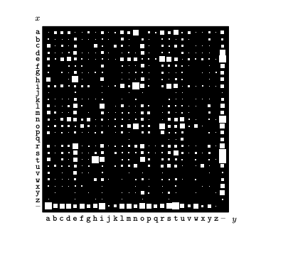
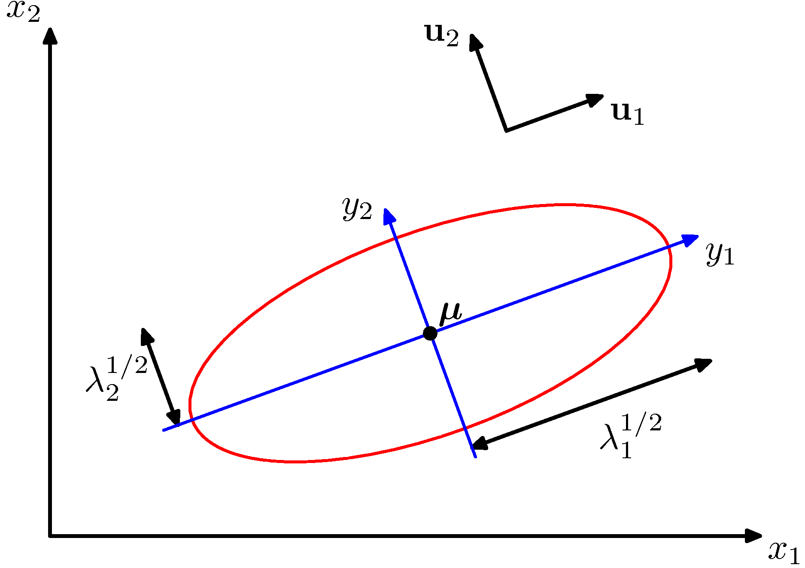

## Book Chapters
 From Ian Goodfellow's book:
<iframe src="https://www.deeplearningbook.org/contents/prob.html" width="800" height="1200"></iframe>

We will go through the main points during the lecture and treat also [MacKay's book (Chapter 2)](https://www.inference.org.uk/itprnn/book.pdf) that is also instructive and a much better in introducing probability concepts. If you are a visual learner, [the visual information theory](http://colah.github.io/posts/2015-09-Visual-Information/#fn4) blog post is also a good starting point. 

## Key Concepts to understand

### Probability
The pictures below are from MacKays book and despite their conceptual simplicity they hide many questions that we will go over the lecture. 

#### Probability distributions

*Probability distribution over the letters of the English alphabet (letter 27 symbolizes space) as measured by reading the Linux FAQ document.*

**Joint probability distributions**

*Joint probability $P(x,y)$ distribution over the 27x27 possible bigrams $xy$ found in this document: https://www.tldp.org/FAQ/pdf/Linux-FAQ.pdf*

What is the marginal probability $P(x)$ ?

**Conditional probability distribution**

*Conditional probability distribution over the 27x27 possible bigrams $xy$ found in this document: https://www.tldp.org/FAQ/pdf/Linux-FAQ.pdf*

Are $x$ and $y$ independent ?

#### Probability Rules

If H is the hypothesis governing the probabilities distributions,

**Product or chain rule**:

This is obtained from the definition of conditional probability:

$P(x,y|H) = P(x | y,H)P(y | H) = P(y | x,H)P(x |H)$

**Sum rule**:

This is obtaining by rewriting of the marginal probability denition:
$P(x |H)   = \sum_y P(x,y |H) = \sum_y P(x | y,H)P(y |H)$

### Key probability distributions

#### Multi-variate Gaussian distribution

$$f_{\mathbf X}(x_1,\ldots,x_k) = \frac{\exp\left(-\frac 1 2 ({\mathbf x}-{\boldsymbol\mu})^\mathrm{T}{\boldsymbol\Sigma}^{-1}({\mathbf x}-{\boldsymbol\mu})\right)}{\sqrt{(2\pi)^n|\boldsymbol\Sigma|}}$$
where where <${\mathbf x}$ is a real 'n'-dimensional column vector and $|\boldsymbol\Sigma|\equiv \operatorname{det}\boldsymbol\Sigma$ is the determinant of $\boldsymbol\Sigma$. 

Apart from the definition, you need to connect the geometric interpretation of the bivariate Gaussian distribution to the eigendecomposition in the linear algebra lecture as shown in the Figure 2.7 of Bishop:

Such geometric interpretations will be very useful when we study dimensionality reduction via Principal Component Analysis (PCA).

### Probabilistic Modeling 

1. The whole purpose of probabilistic modeling is to introduce uncertainty into our problem statement. There are three types of uncertainties:

    * Inherent stochasticity - e.g. impact of wind in self-driving car control systems at moderate to high speed. 
    * Incomplete observability - e.g. sensor imperfections causing loss of sensing information
    * Incomplete modeling - e.g. models and algorithms that are not implementable to an analog world and need to be discretized.

2. Probabilities can be used in two ways.
    * Probabilities can describe frequencies of outcomes in random experiments
    * Probabilities can also be used, more generally, to describe degrees of belief in propositions that do not involve random variables. This more general use of probability to quantify beliefs is known as the Bayesian viewpoint. It is also known as the subjective interpretation of probability, since the probabilities depend on assumptions.

3. The Bayesian theorem is the cornerstone of probabilistic modeling. If $\mathbf{\theta}$ denotes the unknown parameters, $D$ denotes the dataset and $\mathcal{H}$ denotes the hypothesis space  - the model we have seen in [the learning problem]() chapter.

$$ P(\mathbf{\theta} | D, \mathcal{H}) =  \frac{P( D | \mathbf{\theta}, \mathcal{H}) P(\mathbf{\theta} | \mathcal{H}) }{ P(D|\mathcal{H})} $$

The Bayesian framework allows the introduction of priors from a wide variety of sources (experts, other data, past posteriors, etc.) For example,a medical patient is exhibiting symptoms x, y and z. There are a number of diseases that could be causing all of them, but only a single disease is present. A doctor (the expert) has beliefs about which disease, but a second doctor may have slightly different beliefs.

> NOTE: The [Probabilistic Programming & Bayesian Methods for Hackers](http://camdavidsonpilon.github.io/Probabilistic-Programming-and-Bayesian-Methods-for-Hackers/) book is one of the best resources out there containing practical python examples. In addition they have been recoded recently to work in [Tensorflow Probability](https://medium.com/tensorflow/an-introduction-to-probabilistic-programming-now-available-in-tensorflow-probability-6dcc003ca29e) an industrial-strength framework that can bring together Deep Learning and domain-specific probabilistic modeling. The book cant match the rigorousness of Bishop's book but it offers a good treatment on problems and use cases and should be considered complimentary.

### Information-theoretic definitions

#### Entropy
An outcome $x_t$ carries information that is a function of the probability of this outcome $P(x_t)$ by, 

$I(x_t) = \ln \frac{1}{P(x_t)} = - \ln P(x_t)$

This can be intuitively understood when you compare two outcomes. For example, consider someone is producing the result of the vehicular traffic outside of Holland tunnel on Monday morning. The information that the results is "low" carries much more information when the result is "high" since most people expect that there will be horrendous traffic outside of Holland tunnel on Monday mornings. When we want to represent the amount of uncertainty over a distribution (i.e. the traffic in Holland tunnel over all times) we can take the expectation over all possible outcomes i.e.

$H(P) =  - \mathbb{E} \ln P(x)$

and we call this quantity the **entropy** of the probability distribution $P(x)$. When $x$ is continuous the entropy is known as **differential entropy**. Continuing the alphabetical example, we can determine the entropy over the distribution of letters in the sample text we met before as,

This is 4.1 bits (as the $\log$ is taken with base 2). This represents the average number of bits required to transmit each letter of this text to a hypothetical receiver. Note that we used the information carried by each "outcome" (the letter) that our source produced. If the source was binary, we can plot the entropy of such source over the probability p that the outcome is a 1 as shown below,

The plot simply was produced by taking the definition of entropy and applying to the binary case,

$H(p) = - [p \ln p - (1-p) \ln(1-p)]$

As you can see the maximum entropy is when the outcome is most unpredictable i.e. when a 1 can show up with uniform probability (in this case equal probability to a 0). 

#### Relative entropy or KL divergence

In the [ML problem statement](../ml-math/ml-problem-statement), it is evident that the job of the learning algorithm is to come up with a final hypothesis that is close to the *unknown* target function. In other occasions, we need to approximate a distribution by sampling from another easier to model distribution. As in ML we work with probabilities, we need to have a metric that compares two probability distributions $\{P(x),Q(x)\}$ in terms of their "distance" from each other (the quotes will be explained shortly). This is given by the quantity known as *relative entropy* or *KL divergence*. 

$KL(P||Q)= \mathbb{E}[\ln P(x) - \ln Q(x)]$

If the two distributions are identical, $KL=0$ - in general however $KL(P||Q) \ge 0$. One key element to understand is that $KL$ is not a true distance metric as its assymetric. Ensure that you understand fully the following figure and caption. 

Very close to the relative entropy is probably one of the most used information theoretic concepts in ML: **the cross-entropy**. We will motivate cross entropy via a diagram shown below,

### Background for logistic regression

If $\sigma$ is a probability of an event, then the ratio $\frac{\sigma}{1-\sigma}$ is the corresponding *odds*, the ratio of the event  occurring divided by not occurring. For example, if a race horse runs 100 races and wins 25 times and loses the other 75 times, the probability of winning is 25/100 = 0.25 or 25%, but the odds of the horse winning are 25/75 = 0.333 or 1 win to 3 loses. In the binary classification case, the log odds is given by 

$$ \mathtt{logit}(\sigma) = \alpha = \ln \frac{\sigma}{1-\sigma} = \ln \frac{p(\mathcal{C}_1|\mathbf{x})}{p(\mathcal{C}_2|\mathbf{x})}$$

What is used in ML though is the logistic function of any number $\alpha$ that is given by the inverse logit:

$$\mathtt{logistic}(\alpha) = \sigma(\alpha) = \mathtt{logit}^{-1}(\alpha) =  \frac{1}{1 + \exp(-\alpha)} = \frac{\exp(\alpha)}{ \exp(\alpha) + 1}$$

and is plotted below. It maps its argument to the "probability" space [0,1]. 

*Logistic sigmoid (red)*

The sigmoid function satisfies the following symmetry:

$$\sigma(-\alpha) = 1 - \sigma(\alpha)$$

In addition it offers very convenient derivatives and has been used extensively in deep neural networks (for many architectures has been superceded by RELU). The derivative can be obtained as follows:

Consider
$$
f(x)=\dfrac{1}{\sigma(x)} = 1+e^{-x}
.
$$
Then, on the one hand, the chain rule gives
$$
f'(x)
= \frac{d}{dx} \biggl( \frac{1}{\sigma(x)} \biggr)
= -\frac{\sigma'(x)}{\sigma(x)^2}
,
$$
and on the other hand,
$$
f'(x)
= \frac{d}{dx} \bigl( 1+e^{-x} \bigr)
= -e^{-x}
= 1-f(x)
= 1 - \frac{1}{\sigma(x)}
= \frac{\sigma(x)-1}{\sigma(x)}
$$

Equating the two expressions we finally obtain,

$$\sigma'(x) = \sigma(x)(1-\sigma(x))$$ 