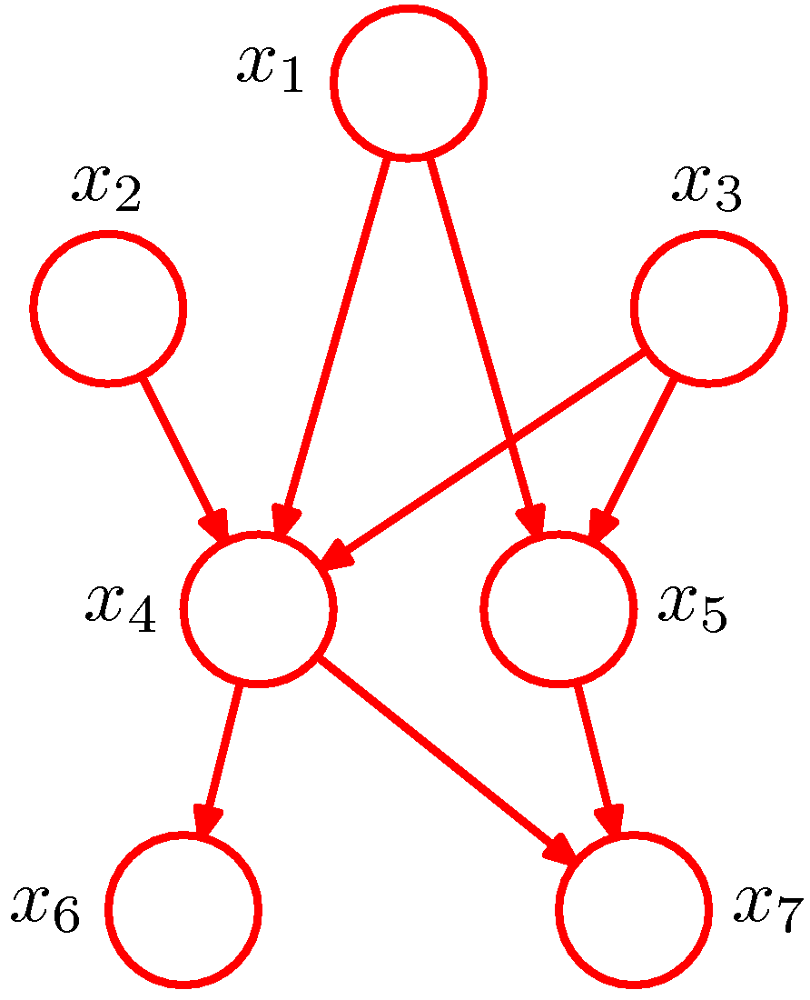

# Introduction to Probabilistic Reasoning

In the [scene understanding]() chapter we started putting together the perception pipelines that resulted in us knowing where are the objects of interest in the image coordinate frame but we stopped short of any advanced methods that can lead to what we humans call _understanding_. We hinted that assigning an object an symbolic identity is an essential ability that allows an embodied AI agent to reason about the scene using symbolic reasoning approaches researched by the AI community over many decades. 

*Positioning of probabilistic reasoning subsystem*

Staying in this trajectory, we introduce the topic of reasoning via a probabilistic lens. We argue that enhancing the environment state as determined by the perception subsystem, includes another subsystem that we will call _probabilistic reasoning_ subsystem that allow us to:

* infer the hidden state of the environment _and_ 
* learn the state that the agents internally maintains via appropriate to the task _representations_. 
  
In a subsequent chapter we will enhance the model to include past _actions_ rather than just past percepts. Let us now start with the rule that is the cornerstone of probabilistic modeling and reasoning. 

## The Bayes Rule 

*Thomas Bayes (1701-1761)*

Let $\mathbf{\theta}$ denote the unknown parameters, $D$ denote the dataset and $\mathcal{H}$ denote the hypothesis space that we met in [the learning problem]() chapter. The Bayes rule states:

$$ P(\mathbf{\theta} | D, \mathcal{H}) =  \frac{P( D | \mathbf{\theta}, \mathcal{H}) P(\mathbf{\theta} | \mathcal{H}) }{ P(D|\mathcal{H})} $$

The Bayesian framework allows the introduction of priors $p(\theta | \mathcal{H})$ from a wide variety of sources: experts, other data, past posteriors, etc. It allows us to calculate the posterior distribution from the likelihood function and this prior subject to a normalizing constant. We will call _belief_ the internal to the agent posterior probability estimate of a random variable as calculated via the Bayes rule.  For example,a medical patient is exhibiting symptoms x, y and z. There are a number of diseases that could be causing all of them, but only a single disease is present. A doctor (the expert) has _beliefs_ about the underlying disease, but a second doctor may have slightly different _beliefs_.

## Probabilistic Graphical Models 

Let us now look at a representation, _the probabilistic graphical model (pgm)_ (also called Bayesian network when the priors are captured) that can be used to capture the _structure_ of such beliefs and in general capture dependencies between the random variables involved in the modeling of a problem. We can use such representations to efficiently compute such beliefs and in general conditional probabilities. For now we will limit the modeling horizon to just one snapshot in time - later we will expand to capture problems that include time $t$ as a variable. 

By convention we represent in PGMsas directed graphs, with nodes being the random variables involved in the model and directed edges indicating a parent child relationship, with the arrow pointing to a child, representing that the child nodes are _probabilistically conditioned on the parent(s)_. 

In a hypothetical example of a joint distribution with $K=7$ random variables, 

_PGM governing the joint distribution $p(x_1, x_2, ..., x_7)=p(x_1)p(x_2)p(x_3)p(x_4|x_1, x_2, x_3)p(x_5|x_1, x_3) p(x_6|x_4)p(x_7|x_4, x_5)$_

In general, 

$$p(\mathbf x)= \prod_{k=1}^K p(x_k | \mathtt{pa}_k)$$

where $\mathtt{pa}_k$ is the set of parents of $x_k$.

Note that we have assumed that our model does _not_ have variables involved in directed cycles and therefore we call such graphs Directed Acyclic Graphs (DAGs). 
