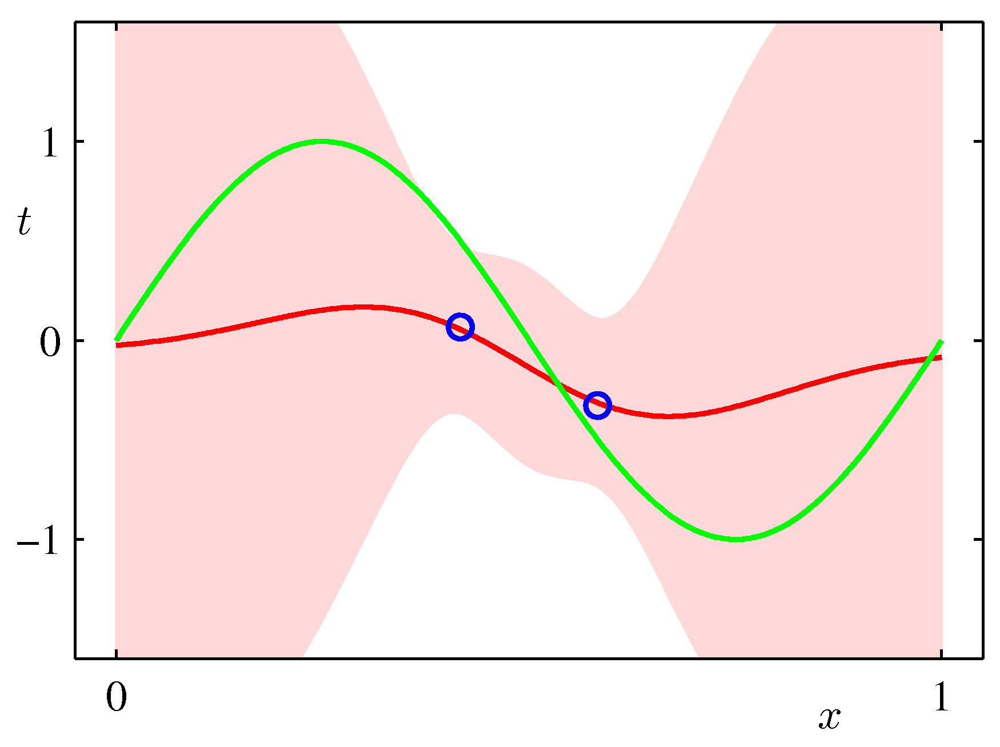

# Bayesian Linear Regression

*Thomas Bayes (1701-1761)*

The treatment in this section will proceed as follows. First we will discuss the Ordinary Least Squares  (or the Maximum Likelihood) estimate of the model parameters. We will then introduce the Bayesian approach to estimating the model parameters and look at the so called *predictive* distribution for the simple [data set](/docs/lectures/ml-math/ml-problem-statement) we started our journey on.

## OLS as Maximum Likelihood Estimation

[These notes](https://www.cs.indiana.edu/~predrag/classes/2016fallb365x/ols.pdf) summarize the ML approach (in section 2) and are provided here as they are more expansive compared to Bishop Section 1.2.5 and at the same time do make the connection to the [Linear Algebra lecture](/docs/lectures/ml-math/linear-algebra-for-ml).  

*Geometrical Interpretation of Ordinary Least Squares*

## Bayesian Linear Regression

In the [probability section](/docs/lectures/ml-math/probability) we have covered an instructive example of coin tossing and saw how the posterior distribution is updated with the draws. The Bayesian setting is obviously generic enough and here we provide just the intuition (for the interested reader the mathematical treatment is in Bishop Section 3.3) behind its application to linear regression.

The Bayesian update of the posterior can be intuitively understood using a graphical example of a linear model of the form:
$$g(x,\mathbf{w})= w_0 + w_1 x$$ (our hypothesis). The reason why we pick this example is illustrative as the model has just two parameters and is amendable to visualization. 

*Instructive example of Bayesian learning as data points are streamed in. Notice the dramatic improvement in the posterior the moment the 2nd data point arrives. Why is that?*

Back to our model for the sinusoidal dataset, and assuming Gaussian basis functions, we can look at the predictive distribution as the number of data points are coming in. 

$$p(\mathbf{w}|y) = \frac{p(y|\mathbf{w}) p(\mathbf{w})}{\int p(y|\mathbf{w}) p(\mathbf{w}) d\mathbf{w}}$$
    
* posterior $\propto$ likelihood $\times$ prior
* The likelihood function is central to both Bayesian and frequentist paradigms. 
* In the frequentist paradigm the $\mathbf{w}$ is treated as a known quantity with an estimate $\hat{\mathbf{w}}$ that has a mean and variance resulting from the distribution of $y$.  
*  In the Bayesian setting, we are integrating over the distribution of $\mathbf{w}$ given the data i.e. we are not making a point estimate of $\mathbf{w}$ but we marginalize out $\mathbf{w}$. 
