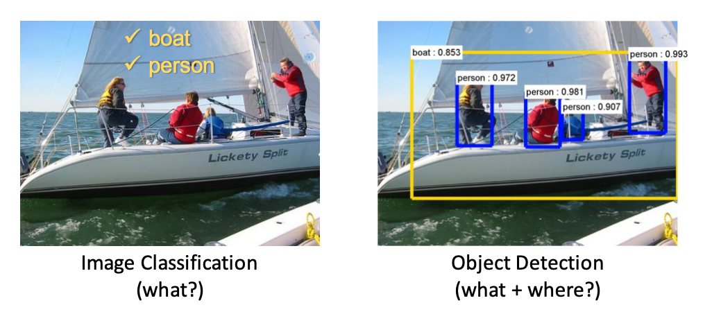
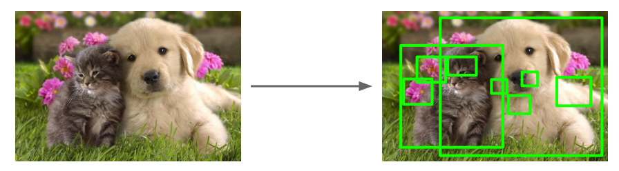
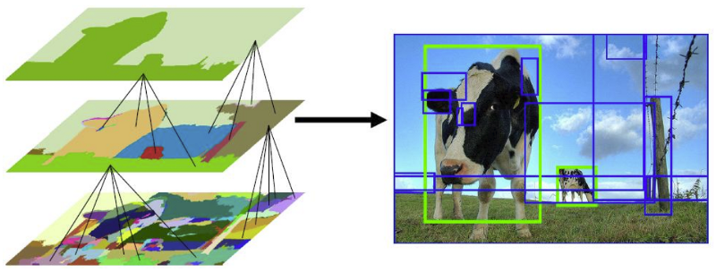
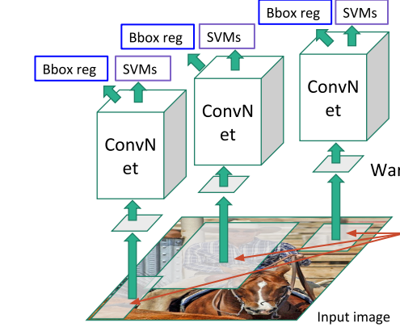
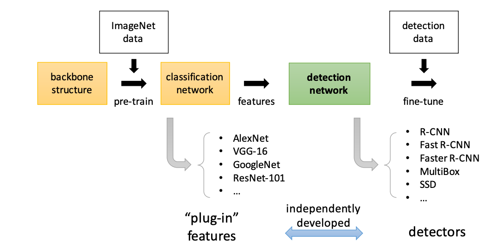

## Problem Statement 
Object detection is demonstrated in this short video clip that shows the end result of the algorithm. 

<iframe width="560" height="315" src="https://www.youtube.com/embed/WZmSMkK9VuA" frameborder="0" allow="accelerometer; autoplay; encrypted-media; gyroscope; picture-in-picture" allowfullscreen></iframe>

Its important to understand the difference between classification, localization and object detection as shown below.

In classification we are given images (we can consider video clips as a sequence of images) and we are asked to produce the array of labels that are present in the frame. Typically in many datasets there is only one class and the images are cropped around the object. In localization, in addition to classification we are interested in locating (using for example a bounding box) each class in the frame and typically we have one class. In object detection we are doing localization for many objects (some objects can be of the same class.)

## Localization

Localization is a regression problem fundamentally: 

$y = f(x)$

We try to come up with a function approximation to the true function $f$ that maps the image $x$ information to the location of the bounding box $y$. We can uniquely represent the bounding box by the (x,y) coordinates of its upper left corner and its width and height $[x,y,w,h]$. Being a regression problem we can use well known loss functions e.g. MSE where the error is the Euclidean distance between the coordinates of the true bounding box and the estimated bounding box. 

## Region Proposals 

Assuming that we have the means to classify correctly a class using a deep CNN, we can think about the detection problem as a classification problem of all possible portions (windows/masks) of the input image. Since this number may be large and therefore expensive we can think of how to reduce this number by having some means to gauging where to look in the image. We call this functionality, **region proposals**

The proposals are class independent and these [Region Proposal Networks (RPN)](https://arxiv.org/pdf/1311.2524.pdf) can very quickly, using [selective search](http://www.huppelen.nl/publications/selectiveSearchDraft.pdf),  produce regions where *some* object may be located. 

Each of these proposals can be fed into a CNN (e.g. ResNet). The CNN is assumed that has been trained for the object detection dataset classes (usually we may do transfer learning and use the model from a CNN that has been trained for a slightly different set of classes). The trained CNN can then extract features (and these features can then be stored) per input image. Using these features we can then train a binary classifier (e.g. SVNM that produces a positive or negative on whether this feature contains the class of interest or not. We usually train a separate binary SVM classifier per class. The whole process is partially shown below and the solution is called Region-CNN (RCNN). 

## [Faster RCNN](https://arxiv.org/abs/1506.01497)
To improve the inference latency the following advancement was done (in two steps Fast-RCNN and Faster RCNN but we only need to care about the latest development).

In this approach there is one CNN network that does not only produces a **global** feature map but also it produces proposals from the feature map itself rather than the original image. It is doing so by sliding a window over the feature map and for each window we project a set of **anchor boxes** back to the image space. The RPN network produces a classification score i.e. how confident we are that there is an object for each of the anchor boxes as well as the regression on the anchor box coordinates. 

## E2E flow

The end to end workflow summarising all the above is shown below:

<!-- 
https://github.com/rafaelpadilla/Object-Detection-Metrics -->